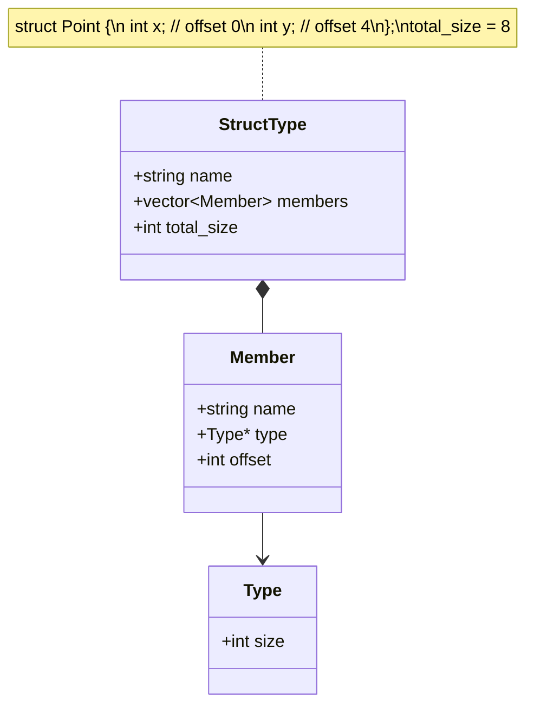

# Lesson 0022: Struct Declarations

## Status: ✅ Complete | Phase: Data Structures | Effort: Hard (8-12h)

## Objective

Parse and store struct type definitions. The codegen needs each struct's
field layout (name → offset, size) to be available at codegen time, both
for member access (lesson 0023) and for `sizeof` of struct types.

## Struct Declaration and Layout



## Implementation Checklist

- [x] Parse `struct Name { type member; ... }`
- [x] Calculate member offsets (sequential, no alignment padding — see Status)
- [x] Calculate total struct size (sum of member sizes)
- [x] Register struct types in `struct_layouts_` map
- [x] Support nested structs
- [ ] Support forward struct declarations (treated as opaque type — see Status)
- [x] Test: `struct Point { int x; int y; }; sizeof(struct Point)` → 8

## Implementation Details

The core trick: a single pass over the field list at codegen time fills
the `struct_layouts_` map. Subsequent member-access code looks up the
layout by name.

### Codegen — building the layout

When the codegen visits a `StructDeclNode`, it walks the field list in
order, accumulating the byte offset. Each field's `size` is determined
by `get_type_size()`, which already knows about pointers, ints, and
(importantly) recursively looks up nested struct names. The completed
layout is keyed by the struct's tag name and stored in
`struct_layouts_` (`src/codegen.cpp:600-616`):

```cpp
// src/codegen.cpp:600-616
void CodeGenerator::visit(StructDeclNode& node) {
    // Build struct layout for member access
    std::vector<FieldInfo> fields;
    int offset = 0;
    for (auto& field_ast : node.fields) {
        auto* field = static_cast<StructFieldNode*>(field_ast.get());
        int field_size = get_type_size(field->type_name);
        FieldInfo fi;
        fi.name = field->name;
        fi.type = field->type_name;
        fi.offset = offset;
        fi.size = field_size;
        fields.push_back(fi);
        offset += field_size;
    }
    struct_layouts_[node.name] = fields;
}
```

The `FieldInfo` and `struct_layouts_` containers are declared in
`src/codegen.h:128-134`:

```cpp
// src/codegen.h:128-134
// Struct layouts for member access
struct FieldInfo {
    std::string name;
    std::string type;
    int offset;
    int size;
};
std::map<std::string, std::vector<FieldInfo>> struct_layouts_;
```

### Layout lookups

Two helpers in `src/codegen.cpp:2093-2107` answer the questions the rest
of the compiler asks: "how big is this struct?" and "where is this
field?".

```cpp
// src/codegen.cpp:2093-2107
int CodeGenerator::get_struct_size(const std::string& name) {
    if (!struct_layouts_.count(name)) return 0;
    const auto& fields = struct_layouts_[name];
    if (fields.empty()) return 0;
    const auto& last = fields.back();
    return last.offset + last.size;
}

int CodeGenerator::get_field_offset(const std::string& struct_name,
                                    const std::string& field_name) {
    if (!struct_layouts_.count(struct_name)) return -1;
    for (const auto& f : struct_layouts_[struct_name]) {
        if (f.name == field_name) return f.offset;
    }
    return -1;
}
```

## Example

```c
// src/example.c
struct Point { int x; int y; };
int main() { return 0; }
```

The struct declaration itself emits no assembly — it just populates
the in-memory layout map used by later member accesses. A function that
accesses `p.x` and `p.y` will see offsets 0 and 4 respectively.

## Status

- **Lexer**: ✅ `struct` recognized as keyword
- **Parser**: ✅ Parses `struct Name { ... };` definitions; recognizes
  `struct Name` as a type specifier
- **Codegen**: ✅ Builds field layout in `struct_layouts_`; looks up
  size and offset on demand
- **Note (alignment)**: ⚠️ Members are packed with no padding —
  `struct { char c; int i; }` is 5 bytes, not 8. `sizeof` follows.
- **Note (forward decl)**: A bare `struct Foo;` without a body is not
  recognised; the parser requires a `{ ... }` block to build a
  `StructDeclNode`.
