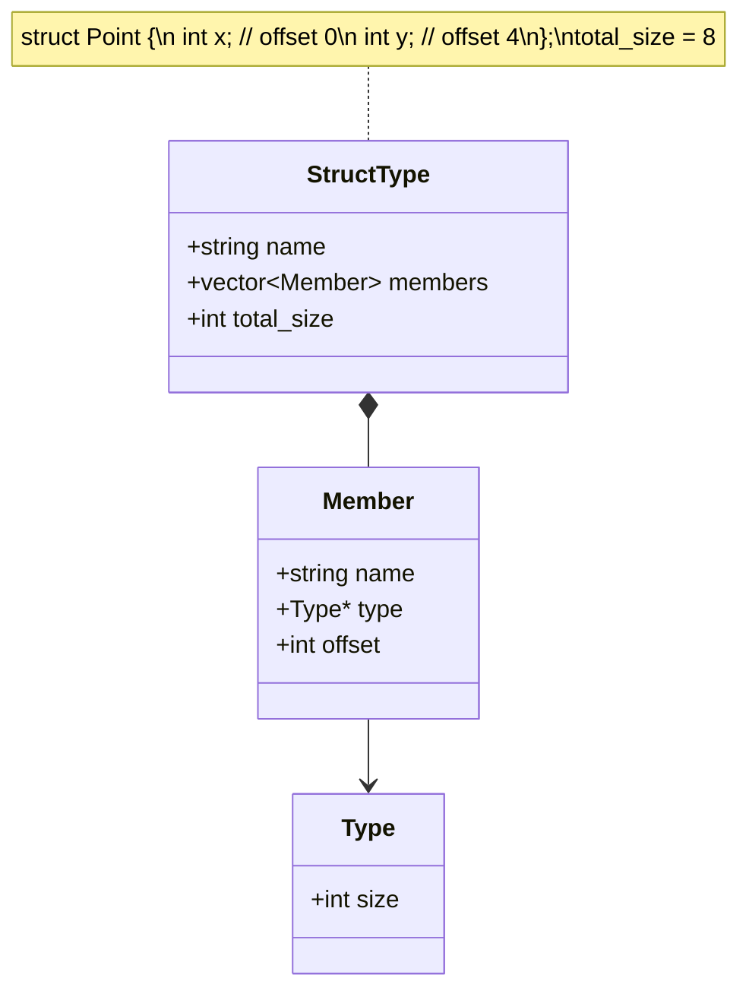

# Lesson 0022: Struct Declarations

## Status: 📋 Planned | Phase: Data Structures | Effort: Hard (8-12h)

## Objective

Parse and store struct type definitions.

## Struct Declaration and Layout

## Implementation Checklist

- [ ] Parse `struct Name { type member; ... }`
- [ ] Calculate member offsets with alignment
- [ ] Calculate total struct size with padding
- [ ] Register struct types in type system
- [ ] Support nested structs
- [ ] Support forward struct declarations
- [ ] Test: `struct Point { int x; int y; }; sizeof(struct Point)` → 8

## Implementation Details

| Component | Source File | Lines | Description |
|-----------|-----------|-------|-------------|
| Struct keyword token | `src/lexer.cpp` | `107` | Maps `struct` keyword to `TokenType::KW_STRUCT` |
| Struct type specifier | `src/parser.cpp` | `139-142` | Recognizes `struct` as a type specifier prefix |
| Struct definition parsing | `src/parser.cpp` | `252-299` | Parses `struct Name { type member; ... }` syntax |
| `parse_struct_decl()` | `src/parser.cpp` | `498-529` | Dedicated struct declaration parser function |
| `StructFieldNode` AST | `src/ast.h` | `224-231` | AST node for individual struct fields |
| `StructDeclNode` AST | `src/ast.h` | `233-240` | AST node holding struct name and field list |
| Struct layout codegen | `src/codegen.cpp` | `383-398` | Builds field offset map in `struct_layouts_` |
| `get_struct_size()` | `src/codegen.cpp` | `1216-1218` | Computes total struct size from layout |
| `get_field_offset()` | `src/codegen.cpp` | `1224-1226` | Looks up byte offset for a named field |
