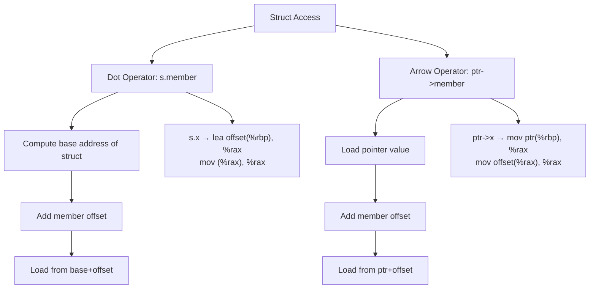

# Lesson 0023: Struct Member Access

## Status: ✅ Complete | Phase: Data Structures | Effort: Medium (6-8h)

## Objective

Implement `.` and `->` operators for struct access.

## Struct Access Operators

## Implementation Checklist

- [ ] Codegen for dot operator: `base + offset`
- [ ] Codegen for arrow operator: deref then add offset
- [ ] Handle nested member access: `s.point.x`
- [ ] Handle pointer members: `s->ptr`
- [ ] Struct assignment (memcpy)
- [ ] Test: `struct Point p; p.x = 10; return p.x;` → 10

## Implementation Details

| Component | Source File | Lines | Description |
|-----------|-----------|-------|-------------|
| Dot operator parsing | `src/parser.cpp` | `1194-1200` | Parses `obj.member` into `MemberExprNode(is_arrow=false)` |
| Arrow operator parsing | `src/parser.cpp` | `1201-1207` | Parses `ptr->member` into `MemberExprNode(is_arrow=true)` |
| `MemberExprNode` AST | `src/ast.h` | `470-478` | AST node with `object`, `member`, and `is_arrow` fields |
| `compute_member_address()` | `src/codegen.cpp` | `338-377` | Computes `base + field_offset`; dereferences for arrow |
| `visit(MemberExprNode)` | `src/codegen.cpp` | `899-905` | Codegen: compute address then `mov (%rax), %rax` |
| Arrow dereference | `src/codegen.cpp` | `351-354` | Arrow operator emits `mov (%rax), %rax` to deref pointer |
| Struct type resolution | `src/codegen.cpp` | `357-366` | Resolves variable's struct type via `variable_types_` |
| Assignment to member | `src/codegen.cpp` | `654` | Handles `struct_member = expr` assignment targets |
| Address-of member | `src/codegen.cpp` | `710` | Handles `&(s.field)` via `compute_member_address()` |
