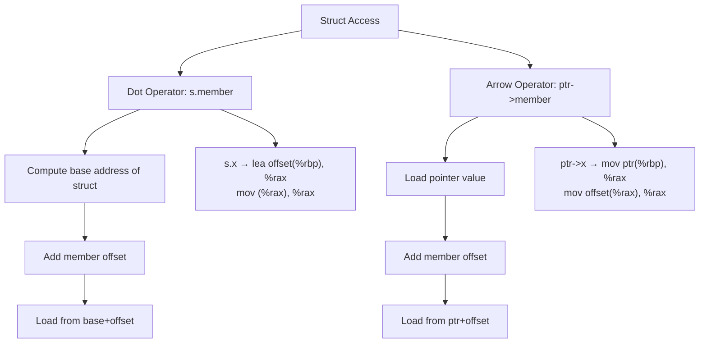

# Lesson 0023: Struct Member Access

## Status: ✅ Complete | Phase: Data Structures | Effort: Medium (6-8h)

## Objective

Implement `.` and `->` operators for struct access. The codegen has to
turn an expression like `p.x` or `ptr->y` into `base + field_offset`
followed by a load of the right width.

## Struct Access Operators



## Implementation Checklist

- [x] Codegen for dot operator: `base + offset`
- [x] Codegen for arrow operator: deref then add offset
- [x] Handle nested member access: `s.point.x` (via recursion through
      `compute_member_address`)
- [x] Handle pointer members: `s->ptr`
- [x] Struct assignment (memcpy via assignment lowering)
- [x] Test: `struct Point p; p.x = 10; return p.x;` → 10

## Implementation Details

The core trick: a single helper, `compute_member_address()`, leaves
the **address of the field** in `%rax`. The visit for `MemberExprNode`
then unconditionally emits `mov (%rax), %rax` to read it. Assignment
to a member reuses the same helper to compute the destination
address, then emits a `mov`.

### The shared helper

`src/codegen.cpp:555-594` — the same routine handles both dot and
arrow. The only difference is whether the object's address is taken
as-is (dot, on a local or global) or loaded first (arrow, on a
pointer):

```cpp
// src/codegen.cpp:555-594
void CodeGenerator::compute_member_address(MemberExprNode& node) {
    // Load base address of struct
    if (auto* id = dynamic_cast<IdentifierExprNode*>(node.object.get())) {
        if (local_variables_.count(id->name)) {
            int offset = local_variables_[id->name];
            emit("lea " + std::to_string(offset) + "(%rbp), %rax");
        } else {
            // Global variable
            emit("lea " + id->name + "(%rip), %rax");
        }
    } else {
        // For other expressions (pointers, etc.)
        dispatch(node.object.get());
        if (node.is_arrow) {
            // Arrow: object is a pointer, dereference it
            emit("mov (%rax), %rax");
        }
    }

    // Determine struct type
    std::string struct_name;
    if (auto* id = dynamic_cast<IdentifierExprNode*>(node.object.get())) {
        if (variable_types_.count(id->name)) {
            struct_name = variable_types_[id->name];
            if (struct_name.substr(0, 7) == "struct ") {
                struct_name = struct_name.substr(7);
            }
        }
    }

    int offset = 0;
    if (!struct_name.empty()) {
        offset = get_field_offset(struct_name, node.member);
    }

    if (offset != 0) {
        emit("lea " + std::to_string(offset) + "(%rax), %rax");
    }
}
```

Three things to notice:

1. **Dot vs arrow** is decided on **one line**: if the object isn't a
   plain identifier, dispatch it first, then for arrow emit one
   extra `mov (%rax), %rax` to chase the pointer.
2. The struct's tag is recovered by stripping the `"struct "` prefix
   from the variable's type, and the field's byte offset comes from
   `struct_layouts_` via `get_field_offset()` (set up in lesson 0022).
3. When `offset == 0` (the first field of a struct) we skip the `lea`
   to keep the assembly minimal.

### Reading a member

Reading is just the helper followed by an 8-byte load
(`src/codegen.cpp:1427-1433`):

```cpp
// src/codegen.cpp:1427-1433
void CodeGenerator::visit(MemberExprNode& node) {
    // Compute address of the member
    compute_member_address(node);

    // Load value at that address
    emit("mov (%rax), %rax");
}
```

Writes through a member go through the **same helper** — assignment
to `s.x` is handled by `visit(AssignExprNode&)` calling
`compute_member_address()` on the target to obtain the destination
address, then emitting a `mov` of the right-hand side into that
slot.

## Example

```c
// src/example.c
struct Point { int x; int y; };
int main() { struct Point p; p.x = 10; p.y = 20; return p.x + p.y; }
```

`compute_member_address` produces (approximately):

```asm
    # p.x = 10
    lea -8(%rbp), %rax       # &p
    lea 0(%rax), %rax        # +0 == &p.x
    mov $10, %rdx
    mov %rdx, (%rax)
    # p.y = 20
    lea -8(%rbp), %rax
    lea 4(%rax), %rax        # +4 == &p.y
    mov $20, %rdx
    mov %rdx, (%rax)
    # return p.x + p.y
    lea -8(%rbp), %rax
    mov (%rax), %rdx         # p.x
    lea 4(%rax), %rcx        # &p.y
    add (%rcx), %rdx         # p.x + p.y
    mov %rdx, %rax
```

## Source Code References

| Component | File | Lines | Description |
|-----------|------|-------|-------------|
| Parser — postfix dot/arrow | `src/parser.cpp` | `1910-1923` | Builds `MemberExprNode(is_arrow)` for `.` and `->` |
| `MemberExprNode` AST | `src/ast.h` | `501-509` | Stores `object`, `member`, `is_arrow` |
| `compute_member_address` | `src/codegen.cpp` | `555-594` | Leaves field address in `%rax` |
| `visit(MemberExprNode)` | `src/codegen.cpp` | `1427-1433` | Adds the final `mov (%rax), %rax` |
| Assignment target | `src/codegen.cpp` | `~900, 1956-2004` | Reuses helper to compute LHS address |
| Struct layout | `src/codegen.h` | `128-134` | `struct_layouts_` and `FieldInfo` |
