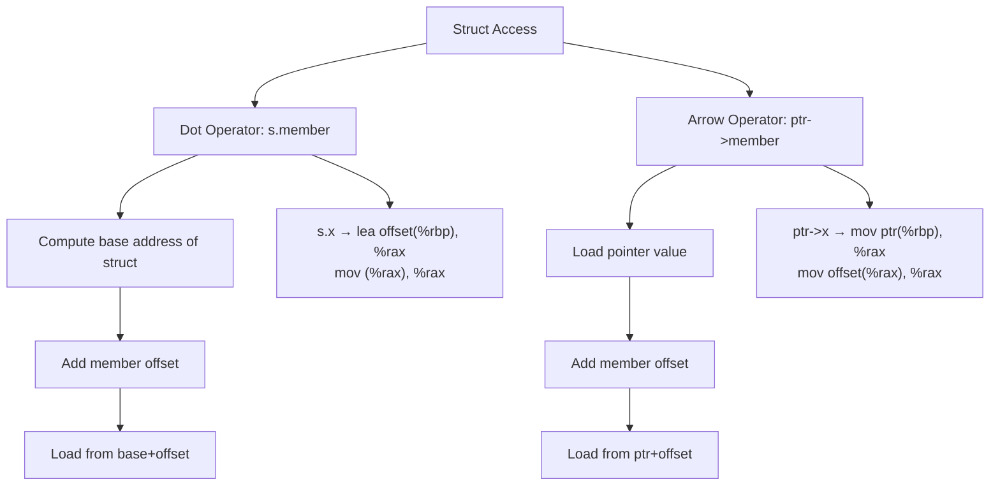

# Lesson 0023: Struct Member Access

## Status: 📋 Planned | Phase: Data Structures | Effort: Medium (6-8h)

## Objective

Implement `.` and `->` operators for struct access.

## Struct Access Operators

## Implementation Checklist

- [ ] Codegen for dot operator: `base + offset`
- [ ] Codegen for arrow operator: deref then add offset
- [ ] Handle nested member access: `s.point.x`
- [ ] Handle pointer members: `s->ptr`
- [ ] Struct assignment (memcpy)
- [ ] Test: `struct Point p; p.x = 10; return p.x;` → 10
