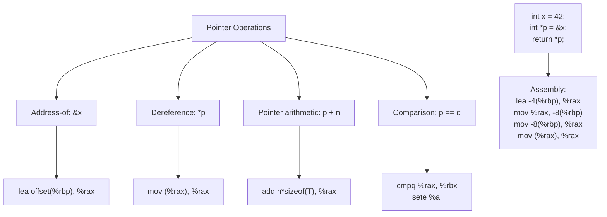

# Lesson 0024: Pointer Types

## Status: 📋 Planned | Phase: Data Structures | Effort: Hard (8-12h)

## Objective

Implement `int*`, `char*`, `void*` pointer types.

## Pointer Operations

## Implementation Checklist

- [ ] Parse pointer declarations: `int *p`, `char **argv`
- [ ] Address-of operator: `&x` → `lea offset(%rbp), %rax`
- [ ] Dereference operator: `*p` → `mov (%rax), %rax`
- [ ] Pointer comparison: `==`, `!=`, `<`, `>`
- [ ] NULL pointer support (0)
- [ ] Test: `int x = 42; int *p = &x; return *p;` → 42
