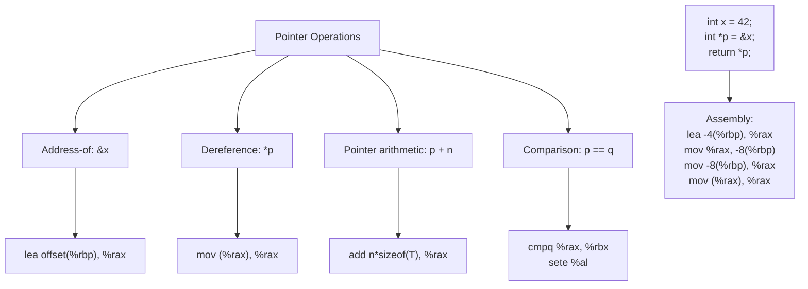

# Lesson 0024: Pointer Types

## Status: ✅ Complete | Phase: Data Structures | Effort: Hard (8-12h)

## Objective

Implement `int*`, `char*`, `void*`, and multi-level pointer types
(`int**`, etc.). The codegen needs to know the **pointed-to size** so
that dereferences use `movzbl`/`movzwl`/`movl`/`mov` as appropriate,
and to know that pointer-typed locals occupy 8 bytes on the stack.

## Pointer Operations



## Implementation Checklist

- [x] Parse pointer declarations: `int *p`, `char **argv`
- [x] Address-of operator: `&x` → `lea offset(%rbp), %rax`
- [x] Dereference operator: `*p` → load of the right width
- [x] Pointer comparison: `==`, `!=`, `<`, `>`
- [x] NULL pointer support (0)
- [x] Test: `int x = 42; int *p = &x; return *p;` → 42

## Implementation Details

The core trick: when a `DerefExprNode` is visited, the codegen has
to figure out **how many bytes to load**. The pointed-to type comes
from either a cast expression (`*(int*)vp`) or the variable's
declared type (`*p` where `p` was declared as `int*`). The result
selects between `movzbl`/`movzwl`/`movl`/`mov`.

### Dereference — load size from type

`src/codegen.cpp:1435-1464` walks the operand to find the pointed-to
type, then dispatches on its size:

```cpp
// src/codegen.cpp:1435-1464
void CodeGenerator::visit(DerefExprNode& node) {
    dispatch(node.operand.get());
    // Determine load size based on the operand's type (cast or pointer)
    int load_size = 8;
    if (auto* cast = dynamic_cast<CastExprNode*>(node.operand.get())) {
        load_size = get_type_size(cast->target_type);
        if (cast->target_type.find('*') != std::string::npos) {
            // Pointer deref: load 8 bytes (the pointer's value)
            load_size = 8;
        }
    } else if (auto* id = dynamic_cast<IdentifierExprNode*>(node.operand.get())) {
        if (variable_types_.count(id->name)) {
            std::string vt = variable_types_[id->name];
            if (vt.find('*') != std::string::npos) {
                // Pointer variable: load the pointed-to type's size
                std::string pointee = vt;
                size_t p = pointee.find('*');
                while (p != std::string::npos) { pointee.erase(p, 1); p = pointee.find('*'); }
                size_t s = pointee.find_first_not_of(" \t");
                size_t e = pointee.find_last_not_of(" \t");
                if (s != std::string::npos) pointee = pointee.substr(s, e - s + 1);
                load_size = get_type_size(pointee);
            }
        }
    }
    if (load_size == 1) emit("movzbl (%rax), %eax");
    else if (load_size == 2) emit("movzwl (%rax), %eax");
    else if (load_size == 4) emit("movl (%rax), %eax");
    else emit("mov (%rax), %rax");
}
```

### Type-size table

`get_type_size` is the single source of truth for layout. Any type
containing `*` is 8 bytes; scalars are sized per ABI
(`src/codegen.cpp:2065-2091`):

```cpp
// src/codegen.cpp:2065-2091
int CodeGenerator::get_type_size(const std::string& type) {
    if (type.find('*') != std::string::npos) return 8;
    if (type == "int" || type == "const int") return 4;
    if (type == "char" || type == "const char") return 1;
    if (type == "bool" || type == "const bool") return 1;
    if (type == "void" || type == "const void") return 8;
    if (type == "long" || type == "const long") return 8;
    if (type == "short" || type == "const short") return 2;
    if (type == "float" || type == "const float") return 4;
    if (type == "double" || type == "const double") return 8;
    ...
}
```

### Address-of

`visit(AddressOfExprNode&)` is a one-liner for the common local case
(`src/codegen.cpp:1466-1481`): emit `lea offset(%rbp), %rax`.

## Example

```c
// src/example.c
int main() { int x = 42; int *p = &x; return *p; }
```

The dereference `*p` is recognised at `DerefExprNode` codegen: `p`'s
type is `int*`, so the pointee is `int` (size 4) and the load
becomes `movl (%rax), %eax`. End-to-end:

```asm
    # int x = 42
    mov $42, %rax
    movl %eax, -4(%rbp)
    # int *p = &x
    lea -4(%rbp), %rax
    mov %rax, -8(%rbp)
    # return *p
    mov -8(%rbp), %rax
    movl (%rax), %eax
```

## Source Code References

| Component | File | Lines | Description |
|-----------|------|-------|-------------|
| Pointer-qualifier parsing | `src/parser.cpp` | `~177-180` | Appends `*` to type string per `*` token |
| Deref/Addr-of parsing | `src/parser.cpp` | `1765-1774` | `*expr` → `DEREF`, `&expr` → `ADDRESS_OF` |
| `DerefExprNode` AST | `src/ast.h` | `511-516` | Single-child expression node |
| `AddressOfExprNode` AST | `src/ast.h` | `518-523` | Single-child expression node |
| Deref codegen | `src/codegen.cpp` | `1435-1464` | Selects load size from cast/var type |
| Address-of codegen | `src/codegen.cpp` | `1466-1481` | `lea offset(%rbp), %rax` for locals |
| `get_type_size` | `src/codegen.cpp` | `2065-2091` | Any pointer type → 8 bytes |
| Arrow operator | `src/codegen.cpp` | `555-594` | Inside `compute_member_address` |
