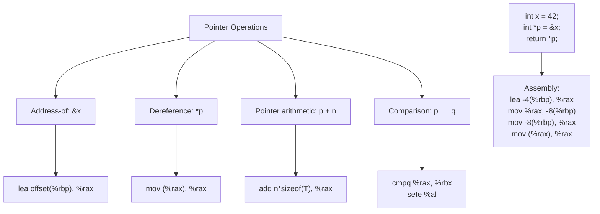

# Lesson 0024: Pointer Types

## Status: ✅ Complete | Phase: Data Structures | Effort: Hard (8-12h)

## Objective

Implement `int*`, `char*`, `void*` pointer types.

## Pointer Operations

## Implementation Checklist

- [ ] Parse pointer declarations: `int *p`, `char **argv`
- [ ] Address-of operator: `&x` → `lea offset(%rbp), %rax`
- [ ] Dereference operator: `*p` → `mov (%rax), %rax`
- [ ] Pointer comparison: `==`, `!=`, `<`, `>`
- [ ] NULL pointer support (0)
- [ ] Test: `int x = 42; int *p = &x; return *p;` → 42

## Implementation Details

| Component | Source File | Lines | Description |
|-----------|-----------|-------|-------------|
| Pointer qualifier parsing | `src/parser.cpp` | `177-180` | Appends `*` to type string for each `*` token |
| Dereference operator (`*p`) | `src/parser.cpp` | `1143-1146` | Parses `*expr` into `UnaryExprNode(OpKind::DEREF)` |
| Address-of operator (`&x`) | `src/parser.cpp` | `1148-1151` | Parses `&expr` into `UnaryExprNode(OpKind::ADDRESS_OF)` |
| `DerefExprNode` AST | `src/ast.h` | `480-485` | AST node for dereference expressions |
| `AddressOfExprNode` AST | `src/ast.h` | `487-492` | AST node for address-of expressions |
| DEREF codegen | `src/codegen.cpp` | `1105-1106` | Emits `mov (%rax), %rax` to dereference |
| ADDRESS_OF codegen | `src/codegen.cpp` | `1108-1127` | Emits `lea offset(%rbp), %rax` for locals, handles `&(*x)` and `&(s.field)` |
| Pointer size (8 bytes) | `src/codegen.cpp` | `812` | `get_type_size()` returns 8 for pointer types |
| Arrow operator (ptr->field) | `src/codegen.cpp` | `351-354` | Dereferences pointer then adds member offset |
