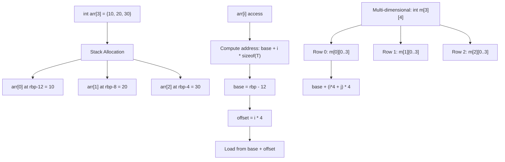

# Lesson 0025: Array Types

## Status: 📋 Planned | Phase: Data Structures | Effort: Hard (8-12h)

## Objective

Implement fixed-size arrays with indexing.

## Array Layout and Indexing

## Implementation Checklist

- [ ] Parse array declarations: `int arr[10]`
- [ ] Parse array initializers: `int arr[] = {1, 2, 3}`
- [ ] Stack allocation for arrays
- [ ] Index expression codegen: `base + i * sizeof(type)`
- [ ] Array-to-pointer decay
- [ ] Multi-dimensional arrays: `int m[3][4]`
- [ ] Test: `int a[3] = {10, 20, 30}; return a[1];` → 20
