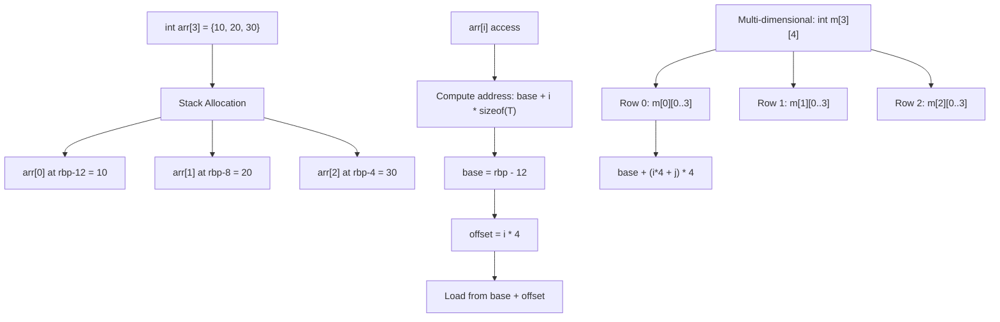

# Lesson 0025: Array Types

## Status: ✅ Complete | Phase: Data Structures | Effort: Hard (8-12h)

## Objective

Implement fixed-size arrays with indexing. The codegen needs to know
the element size and total element count per array — they're recorded
in `array_info_` at the point of declaration and used by
`IndexExprNode` and `SizeofExprNode`.

## Array Layout and Indexing



## Implementation Checklist

- [x] Parse array declarations: `int arr[10]`
- [x] Parse array initializers: `int arr[] = {1, 2, 3}`
- [x] Stack allocation for arrays
- [x] Index expression codegen: `base + i * sizeof(type)`
- [x] Array-to-pointer decay (see lesson 0042)
- [x] Multi-dimensional arrays: `int m[3][4]` (see lesson 0041)
- [x] Test: `int a[3] = {10, 20, 30}; return a[1];` → 20

## Implementation Details

The core trick: every array declaration records its element size and
length in the `array_info_` map keyed by name. Indexing then looks
the map up to scale the index, and array identifiers emit `lea` (the
base address) rather than a `mov` of the first element.

### Allocating the array

`visit(VarDeclNode&)` lays out the array on the stack and records its
shape. The element size comes from `get_type_size(node.type_name)`,
and the total allocation is `elem_size * array_size` rounded up to a
multiple of 8 (`src/codegen.cpp:466-485`):

```cpp
// src/codegen.cpp:466-485
int elem_size = get_type_size(node.type_name);
int alloc_size;
if (node.array_size > 0) {
    alloc_size = elem_size * node.array_size;
} else {
    alloc_size = elem_size;
}
// Align to 8 bytes
int aligned_size = ((alloc_size + 7) / 8) * 8;
if (aligned_size < 8) aligned_size = 8;

stack_offset_ += aligned_size;
int base_offset = -stack_offset_;
local_variables_[node.name] = base_offset;
variable_types_[node.name] = node.type_name;

// For arrays, store the base address and element size info
if (node.array_size > 0) {
    array_info_[node.name] = {elem_size, node.array_size};
}
```

`ArrayInfo` is declared in `src/codegen.h:146-150`:

```cpp
// src/codegen.h:146-150
// Array info (element size, array length)
struct ArrayInfo {
    int elem_size;
    int length;
};
std::map<std::string, ArrayInfo> array_info_;
```

### Indexing

`visit(IndexExprNode&)` looks up the element size, multiplies the
index by it, and adds the result to the base address
(`src/codegen.cpp:1367-1425`):

```cpp
// src/codegen.cpp:1367-1425  (abridged)
void CodeGenerator::visit(IndexExprNode& node) {
    std::string base_type;
    int elem_size = 4; // default to int

    if (auto* id = dynamic_cast<IdentifierExprNode*>(node.array.get())) {
        if (array_info_.count(id->name)) {
            elem_size = array_info_[id->name].elem_size;
        } else if (variable_types_.count(id->name)) {
            // For pointer types, use the pointed-to type's size, not the pointer's size
            ...
        }
    }

    // Load base address (for arrays, this is the address of the first element)
    dispatch(node.array.get());
    emit("push %rax");

    // Load index
    dispatch(node.index.get());

    // Multiply index by element size
    if (elem_size > 1) {
        emit("imul $" + std::to_string(elem_size) + ", %rax");
    }

    // Compute address: base + index * element_size
    emit("pop %rcx");
    emit("add %rcx, %rax");

    // Load value at address — width depends on elem_size
    if (elem_size == 1) emit("movzbl (%rax), %eax");
    else if (elem_size == 4) emit("movl (%rax), %eax");
    else if (elem_size == 8) emit("mov (%rax), %rax");
    else if (elem_size == 2) emit("movzwl (%rax), %eax");
    else emit("mov (%rax), %rax");
}
```

### Array identifiers decay to base address

`visit(IdentifierExprNode&)` notices when the name is in
`array_info_` and emits `lea offset(%rbp), %rax` instead of a load
(`src/codegen.cpp:1556-1560`). This is the array-to-pointer decay in
codegen form.

## Example

```c
// src/example.c
int main() { int arr[3]; arr[0] = 10; arr[1] = 20; arr[2] = 30; return arr[1]; }
```

For `arr[1] = 20` and the subsequent `arr[1]` read, the codegen
emits (approximately):

```asm
    # arr[1] = 20
    lea -12(%rbp), %rax       # &arr[0]
    push %rax                 # save base
    mov $1, %rax              # index
    imul $4, %rax             # × elem_size
    pop %rcx                  # base address
    add %rcx, %rax            # base + index*4
    mov $20, %rdx
    movl %edx, (%rax)         # store
    # return arr[1]
    lea -12(%rbp), %rax
    push %rax
    mov $1, %rax
    imul $4, %rax
    pop %rcx
    add %rcx, %rax
    movl (%rax), %eax
```

## Source Code References

| Component | File | Lines | Description |
|-----------|------|-------|-------------|
| Array declaration parsing | `src/parser.cpp` | `617-671` | Parses `int arr[N]` and sets `var->array_size` |
| `IndexExprNode` AST | `src/ast.h` | `493-499` | Holds `array` and `index` children |
| `ArrayInfo` struct | `src/codegen.h` | `146-150` | `elem_size` + `length` per array |
| Array stack allocation | `src/codegen.cpp` | `466-485` | Allocates `elem_size * array_size` bytes |
| `visit(IndexExprNode)` | `src/codegen.cpp` | `1367-1425` | `base + index * elem_size`, width-dispatched load |
| Array identifier decay | `src/codegen.cpp` | `1556-1560` | `lea offset(%rbp), %rax` for array names |
| Multi-dim flattening | `src/parser.cpp` | `~1831-1909` | Rewrites `a[i][j]` to `a[i*N + j]` (see 0041) |
