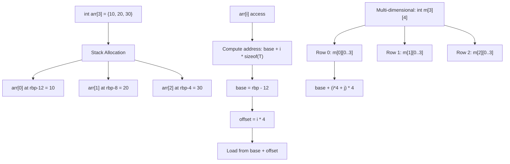

# Lesson 0025: Array Types

## Status: 📋 Planned | Phase: Data Structures | Effort: Hard (8-12h)

## Objective

Implement fixed-size arrays with indexing.

## Array Layout and Indexing

## Implementation Checklist

- [ ] Parse array declarations: `int arr[10]`
- [ ] Parse array initializers: `int arr[] = {1, 2, 3}`
- [ ] Stack allocation for arrays
- [ ] Index expression codegen: `base + i * sizeof(type)`
- [ ] Array-to-pointer decay
- [ ] Multi-dimensional arrays: `int m[3][4]`
- [ ] Test: `int a[3] = {10, 20, 30}; return a[1];` → 20

## Implementation Details

| Component | Source File | Lines | Description |
|-----------|-----------|-------|-------------|
| Array declaration parsing | `src/parser.cpp` | `468-471` | Parses `int arr[N]` and sets `var->array_size` |
| Array parameter decay | `src/parser.cpp` | `605-628` | Treats `int arr[]` params as pointers |
| Index expression parsing | `src/parser.cpp` | `1189-1192` | Parses `arr[expr]` into `IndexExprNode` |
| `IndexExprNode` AST | `src/ast.h` | `462-468` | AST node with `array` and `index` children |
| `ArrayInfo` struct | `src/codegen.h` | `139-143` | Stores `elem_size` and `array_length` per array |
| Array stack allocation | `src/codegen.cpp` | `313-314` | Allocates `elem_size * array_size` bytes on stack |
| Array info registration | `src/codegen.cpp` | `326-328` | Stores `elem_size` and count in `array_info_` map |
| `visit(IndexExprNode)` | `src/codegen.cpp` | `856-897` | Codegen: `base + index * elem_size`, then load |
| Index multiply | `src/codegen.cpp` | `877-879` | Emits `imul $elem_size, %rax` for scaling |
| Array identifier codegen | `src/codegen.cpp` | `945-946` | Returns base address for arrays (no decay to value) |
