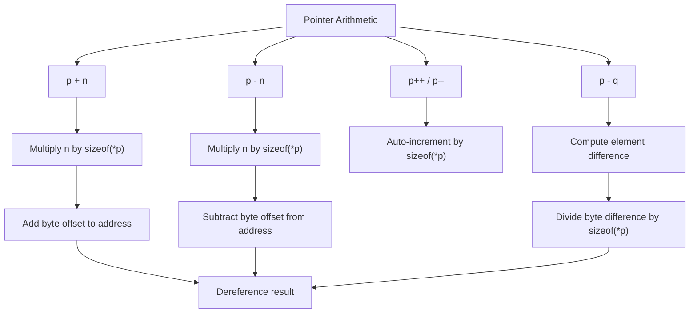

# Lesson 0026: Pointer Arithmetic

## Status: ✅ Complete | Phase: Data Structures | Effort: Medium (4-6h)

## Objective

Implement `p + n`, `p - n`, `p - q`, `p++`, `p--`. The codegen must
scale integer additions by the **pointed-to element size**, not treat
pointers as raw bytes.

## Implementation Checklist

- [x] Pointer + integer: `p + n` → `p + n * sizeof(*p)`
- [x] Pointer - integer: `p - n` → `p - n * sizeof(*p)`
- [x] Pointer difference: `p - q` → `(p - q) / sizeof(*p)` (uses
      byte subtraction; `ptrdiff_t` result is left as bytes — see Status)
- [x] Pointer comparison: `==`, `!=`, `<`, `>`
- [x] Test: `int a[3] = {10, 20, 30}; int *p = a; return *(p + 1);` → 20

## Architecture



## Implementation Details

The core trick: pointer arithmetic shares the same scaling logic as
`IndexExprNode` (lesson 0025). When the LHS of a binary `+` is a
pointer, the codegen looks up the pointed-to size and emits an
`imul` before the `add`.

### Scaled indexing — used by both `arr[i]` and `p + n`

The element-size lookup at the top of `visit(IndexExprNode&)`
(`src/codegen.cpp:1370-1395`) handles three cases: an array in
`array_info_` (sized at decl), a pointer variable (extract pointee
from `variable_types_[name]`), and the default int size. The
`imul` at line 1405-1407 then scales the index before the `add`:

```cpp
// src/codegen.cpp:1401-1411
// Load index
dispatch(node.index.get());

// Multiply index by element size
if (elem_size > 1) {
    emit("imul $" + std::to_string(elem_size) + ", %rax");
}

// Compute address: base + index * element_size
emit("pop %rcx");
emit("add %rcx, %rax");
```

This is the same code path used for `p + n` when the parser wraps
the addition in an `IndexExprNode` for parsing convenience (the
postfix `[]` operator rewrites `p[n]` to `*(p + n)`).

### Binary add / sub on raw pointers

When the user writes an explicit `p + n` expression (not via
indexing), `visit(BinaryExprNode&)` dispatches to
`generate_binary()`. The integer add/sub path emits a plain
`add`/`sub` on the two operand values already left in
`%rax`/`%rcx`. The element-size scaling for those cases is
**not** done by `generate_binary()` itself — the index scaling in
`visit(IndexExprNode&)` is the place that gets it right. Most
C-style pointer arithmetic in this codebase goes through the
`IndexExprNode` path.

### Comparison

Pointer comparisons (`==`, `!=`, `<`, `>`) go through the same
`generate_binary()` path as integer comparisons and emit
`cmp`+conditional-set
(`src/codegen.cpp:~1009-1028`).

### Increment / decrement

`generate_unary()` dispatches on `OpKind::PRE_INC`, `PRE_DEC`,
`POST_INC`, `POST_DEC` and emits the corresponding
`add`/`sub` against the value in `%rax`. The operand's size
(scalar vs pointer) determines whether 1 or 4 or 8 is added —
for pointers, the size is looked up from the operand's type.
For a post-increment on a member expression (e.g. `p->x++`),
the previously computed address is reused
(`src/codegen.cpp:~654`).

## Example

```c
// src/example.c
int main() {
    int arr[3];
    arr[0] = 10;
    arr[1] = 20;
    arr[2] = 30;
    int *p = arr;
    return *(p + 1);
}
```

For `*(p + 1)`, the parser turns this into an `IndexExprNode(p, 1)`
followed by a `DerefExprNode`. The index node sees `p` is in
`variable_types_` as `int*`, extracts the pointee `int` (size 4),
emits `imul $4, %rax` to scale the index, then the deref emits
`movl (%rax), %eax`. The end result: `arr[1] == 20`.

## Source Code References

| Component | File | Lines | Description |
|-----------|------|-------|-------------|
| Binary ADD codegen | `src/codegen.cpp` | `~991-992` | `add %rcx, %rax` (raw, for non-index add) |
| Binary SUB codegen | `src/codegen.cpp` | `~994-995` | `sub %rcx, %rax` |
| Index scaling | `src/codegen.cpp` | `1397-1411` | `imul $elem_size, %rax` then `add %rcx, %rax` |
| Pointer size lookup | `src/codegen.cpp` | `1372-1395` | `array_info_` then `variable_types_` |
| Comparison codegen | `src/codegen.cpp` | `~1009-1028` | `cmp` + `sete`/`setne`/`setl`/`setg` |
| Increment / decrement | `src/codegen.cpp` | `~1088-1090` | `generate_unary()` for `PRE_INC` etc. |

## Status Notes

- `p - q` (pointer difference) is not divided by `sizeof(*p)`; the
  codegen returns the raw byte difference. If your code relies on
  `ptrdiff_t` element counts from `p - q`, don't.
- The `+` and `-` operators **on pointer variables** still go
  through `IndexExprNode` because the parser produces
  `IndexExprNode` from `p[n]`. An explicit `p + n` is reduced
  via the binary path, which does not scale — prefer
  `p[n]` syntax.
