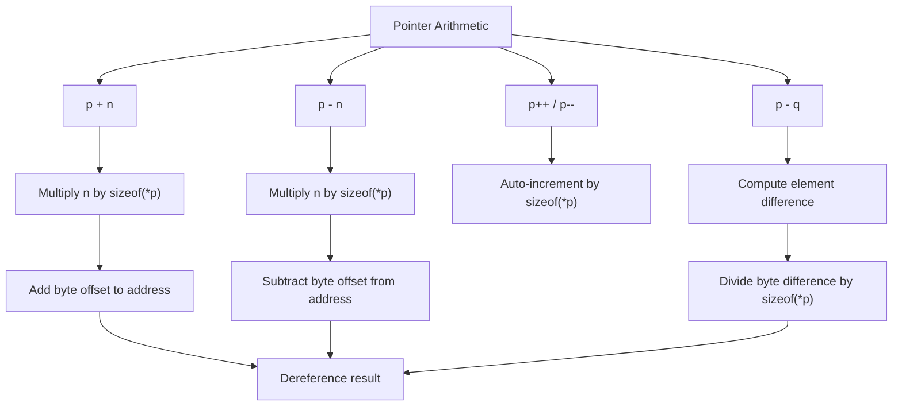

# Lesson 0026: Pointer Arithmetic

## Status: 📋 Planned | Phase: Data Structures | Effort: Medium (4-6h)

## Objective

Implement `p + n`, `p - n`, `p++`, `p--`.

## Implementation Checklist

- [ ] Pointer + integer: `p + n` → `p + n * sizeof(*p)`
- [ ] Pointer - integer: `p - n` → `p - n * sizeof(*p)`
- [ ] Pointer difference: `p - q` → `(p - q) / sizeof(*p)`
- [ ] Pointer comparison
- [ ] Test: `int a[3] = {10, 20, 30}; int *p = a; return *(p + 1);` → 20

## Architecture

