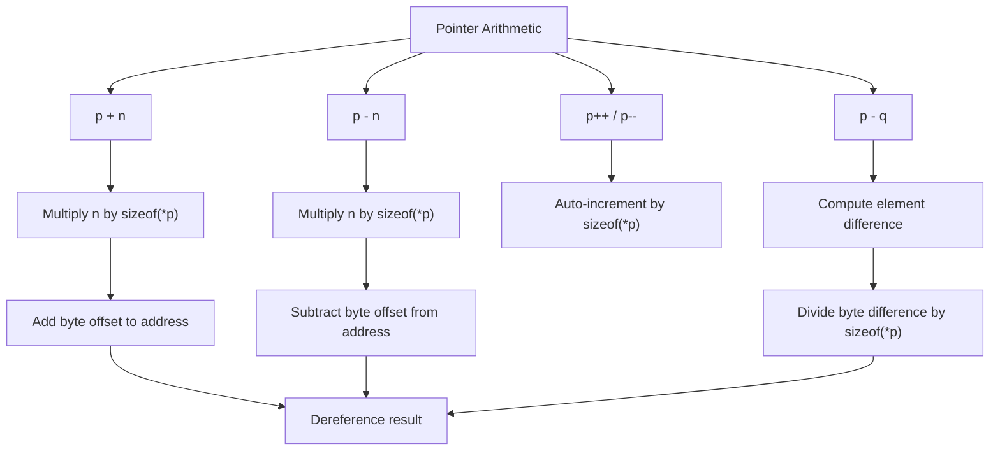

# Lesson 0026: Pointer Arithmetic

## Status: 📋 Planned | Phase: Data Structures | Effort: Medium (4-6h)

## Objective

Implement `p + n`, `p - n`, `p++`, `p--`.

## Implementation Checklist

- [ ] Pointer + integer: `p + n` → `p + n * sizeof(*p)`
- [ ] Pointer - integer: `p - n` → `p - n * sizeof(*p)`
- [ ] Pointer difference: `p - q` → `(p - q) / sizeof(*p)`
- [ ] Pointer comparison
- [ ] Test: `int a[3] = {10, 20, 30}; int *p = a; return *(p + 1);` → 20

## Architecture

## Implementation Details

| Component | Source File | Lines | Description |
|-----------|-----------|-------|-------------|
| Binary ADD codegen | `src/codegen.cpp` | `991-992` | Emits `add %rcx, %rax` (pointer + offset) |
| Binary SUB codegen | `src/codegen.cpp` | `994-995` | Emits `sub %rcx, %rax` (pointer - offset) |
| Index scaling (pointer arithmetic) | `src/codegen.cpp` | `856-897` | `IndexExprNode` multiplies index by `elem_size` for pointer/array indexing |
| Pointer size for arithmetic | `src/codegen.cpp` | `861-866` | Looks up `elem_size` from `array_info_` or `variable_types_` |
| Unary increment (`p++`) | `src/codegen.cpp` | `1088-1090` | `generate_unary()` dispatches operand, post-inc handled separately |
| Post-increment codegen | `src/codegen.cpp` | `654` | Post-inc on member expressions uses saved address |
| Pointer comparison (EQ/NE) | `src/codegen.cpp` | `1009-1016` | `cmp %rcx, %rax` + `sete`/`setne` for `==`/`!=` |
| Pointer comparison (LT/GT) | `src/codegen.cpp` | `1017-1028` | `cmp %rcx, %rax` + `setl`/`setg` for `<`/`>` |
