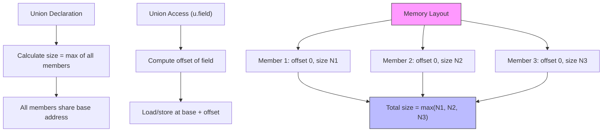

# Lesson 0027: Unions

## Status: ✅ Complete | Phase: Data Structures | Effort: Medium (4-6h)

## Objective

Implement union types with overlapping member storage.

## Implementation Checklist

- [ ] Parse `union` keyword
- [ ] Calculate union size = max(member sizes)
- [ ] All members share base address
- [ ] Union member access (same as struct)
- [ ] Test: `union { int i; float f; } u; u.i = 42; return u.i;` → 42

## Architecture

## Implementation Details

| Component | Source File | Lines | Description |
|-----------|-----------|-------|-------------|
| Union keyword token | `src/lexer.cpp` | `123` | Maps `union` keyword to `TokenType::KW_UNION` |
| Union type specifier | `src/parser.cpp` | `144-149` | Recognizes `union` as a type specifier prefix |
| Union parsing (as struct) | `src/parser.cpp` | `319-362` | Parses `union Name { type member; ... }` reusing `StructDeclNode` |
| Union variable declaration | `src/parser.cpp` | `352-358` | Handles `union Name var;` declarations |
| `visit(StructDeclNode)` | `src/codegen.cpp` | `383-398` | Builds field layout; unions share offset 0 for all fields |
| `FieldInfo` struct | `src/codegen.h` | `121-126` | Stores `name`, `type`, `offset`, `size` per field |
| `struct_layouts_` storage | `src/codegen.h` | `127` | Maps union/struct name to `vector<FieldInfo>` |
| `get_struct_size()` | `src/codegen.cpp` | `1216-1218` | Computes size from layout (max field for unions) |
| `get_field_offset()` | `src/codegen.cpp` | `1224-1226` | Returns byte offset of named field (0 for union members) |
