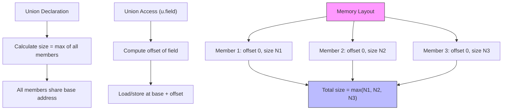

# Lesson 0027: Unions

## Status: 📋 Planned | Phase: Data Structures | Effort: Medium (4-6h)

## Objective

Implement union types with overlapping member storage.

## Implementation Checklist

- [ ] Parse `union` keyword
- [ ] Calculate union size = max(member sizes)
- [ ] All members share base address
- [ ] Union member access (same as struct)
- [ ] Test: `union { int i; float f; } u; u.i = 42; return u.i;` → 42

## Architecture

