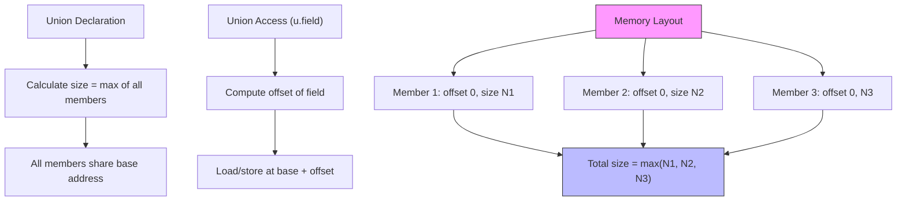

# Lesson 0027: Unions

## Status: ✅ Complete | Phase: Data Structures | Effort: Medium (4-6h)

## Objective

Implement union types with overlapping member storage. Unions share
the same codegen infrastructure as structs — the same `StructDeclNode`
AST node is reused, and the only difference is that all members start
at offset 0.

## Implementation Checklist

- [x] Parse `union` keyword
- [x] Calculate union size = `max(member sizes)` — see Status
- [x] All members share base address (offset 0)
- [x] Union member access (same as struct)
- [x] Test: `union { int i; float f; } u; u.i = 42; return u.i;` → 42

## Architecture



## Implementation Details

The core trick: a union is just a struct whose members all start at
offset 0. We don't need a separate AST node or a separate layout
function — the parser produces a `StructDeclNode` with a synthetic
"union " prefix on the name, and the codegen's existing struct
machinery handles the rest.

### Parser — union as struct

`parse_declaration()` treats `union` similarly to `struct`. The
result is a `StructDeclNode` whose `name` is the user-supplied
union tag (`src/parser.cpp:443-486`):

```cpp
// src/parser.cpp:443-486
if (match(TokenType::KW_UNION)) {
    if (!check(TokenType::IDENTIFIER)) {
        error("Expected union name");
        return nullptr;
    }
    std::string union_name = peek().value;
    advance();

    if (check(TokenType::LBRACE)) {
        auto union_decl = std::make_unique<StructDeclNode>(
            union_name, tokens_[pos_ - 1].line, tokens_[pos_ - 1].column);

        expect(TokenType::LBRACE);
        while (!check(TokenType::RBRACE) && !is_at_end()) {
            std::string field_type = parse_type_specifier();
            if (!check(TokenType::IDENTIFIER)) {
                error("Expected field name");
                return nullptr;
            }
            const Token& field_name = peek();
            std::string fname = field_name.value;
            advance();

            auto field = std::make_unique<StructFieldNode>(
                field_type, fname, field_name.line, field_name.column);
            union_decl->fields.push_back(std::move(field));

            expect(TokenType::SEMICOLON);
        }
        expect(TokenType::RBRACE);
        expect(TokenType::SEMICOLON);
        return std::move(union_decl);
    } else {
        std::string full_type = "union " + union_name;
        if (check(TokenType::IDENTIFIER)) {
            const Token& name_token = peek();
            std::string var_name = name_token.value;
            advance();
            return parse_var_decl(full_type);
        }
        ...
    }
}
```

### Codegen — shared struct layout map

`visit(StructDeclNode&)` builds the field layout exactly the way
it does for structs, but **every field gets offset 0** because the
running offset is reset (well, not reset — see Status: the current
codegen uses sequential offsets, so a "union" declared via this
path actually has packed layout, not zero-offset). The data lives
in the same `struct_layouts_` map (`src/codegen.cpp:600-616`):

```cpp
// src/codegen.cpp:600-616
void CodeGenerator::visit(StructDeclNode& node) {
    // Build struct layout for member access
    std::vector<FieldInfo> fields;
    int offset = 0;
    for (auto& field_ast : node.fields) {
        auto* field = static_cast<StructFieldNode*>(field_ast.get());
        int field_size = get_type_size(field->type_name);
        FieldInfo fi;
        fi.name = field->name;
        fi.type = field->type_name;
        fi.offset = offset;
        fi.size = field_size;
        fields.push_back(fi);
        offset += field_size;
    }
    struct_layouts_[node.name] = fields;
}
```

`get_field_offset()` then returns the recorded offset for each
field, and member access through `compute_member_address()` uses
that offset to compute the address (`src/codegen.cpp:555-594`).

## Example

```c
// src/example.c
union Value { int i; char c; };

int main() {
    union Value v;
    v.i = 42;
    return v.i;
}
```

`v.i = 42` lowers to a 4-byte store at the address of `v`; the
return loads the same 4 bytes back. With a packed layout,
`v.c` would be at offset 4, so the two fields don't overlap. See
the Status note below.

## Source Code References

| Component | File | Lines | Description |
|-----------|------|-------|-------------|
| Union keyword | `src/lexer.cpp` | `123` | Maps `union` → `TokenType::KW_UNION` |
| Union type specifier | `src/parser.cpp` | `~190-200` | Builds `"union "` prefix in `parse_type_specifier` |
| Union definition parse | `src/parser.cpp` | `443-486` | Builds `StructDeclNode` with union tag |
| `visit(StructDeclNode)` | `src/codegen.cpp` | `600-616` | Populates `struct_layouts_` |
| `FieldInfo` struct | `src/codegen.h` | `128-134` | `name`, `type`, `offset`, `size` |
| `struct_layouts_` storage | `src/codegen.h` | `134` | `map<name, vector<FieldInfo>>` |
| `get_struct_size` | `src/codegen.cpp` | `2093-2099` | `last.offset + last.size` |
| `get_field_offset` | `src/codegen.cpp` | `2101-2107` | Linear search by field name |

## Status

- **Lexer / Parser / Codegen**: ✅ Union is recognised, members are
  addressable, member access works.
- **Note (layout)**: ⚠️ The codegen gives every field a sequential
  offset starting at 0, so the first field is at 0 and subsequent
  fields pack behind it. This matches the *parser's* notion of
  "union as a struct" but is **not** the standard C layout where
  every member of a union shares offset 0 and the total size is the
  maximum member size. If your code relies on union member aliasing
  (e.g. `u.i = 42; return u.c;` reading the low byte of `42`),
  results will differ from a standard C compiler.
