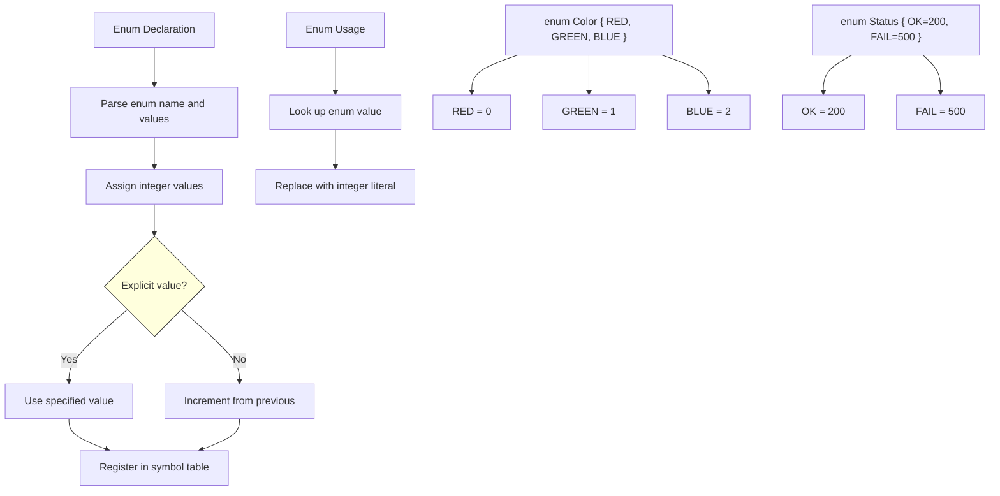

# Lesson 0028: Enums

## Status: 📋 Planned | Phase: Data Structures | Effort: Easy (4-6h)

## Objective

Implement `enum` for named integer constants.

## Implementation Checklist

- [ ] Parse `enum Name { A, B, C }`
- [ ] Auto-assign values (0, 1, 2, ...)
- [ ] Support explicit values: `A = 10`
- [ ] Treat enums as integers
- [ ] Test: `enum Color { RED, GREEN, BLUE }; return GREEN;` → 1

## Architecture

