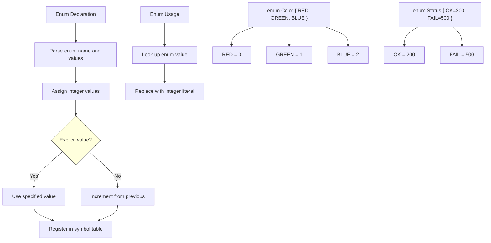

# Lesson 0028: Enums

## Status: ✅ Complete | Phase: Data Structures | Effort: Easy (4-6h)

## Objective

Implement `enum` for named integer constants.

## Implementation Checklist

- [ ] Parse `enum Name { A, B, C }`
- [ ] Auto-assign values (0, 1, 2, ...)
- [ ] Support explicit values: `A = 10`
- [ ] Treat enums as integers
- [ ] Test: `enum Color { RED, GREEN, BLUE }; return GREEN;` → 1

## Architecture

## Implementation Details

| Component | Source File | Lines | Description |
|-----------|-----------|-------|-------------|
| Enum keyword token | `src/lexer.cpp` | `112` | Maps `enum` keyword to `TokenType::KW_ENUM` |
| Enum type specifier | `src/parser.cpp` | `151-156` | Recognizes `enum` as a type specifier prefix |
| Enum dispatch | `src/parser.cpp` | `365-367` | Routes `enum` keyword to `parse_enum_decl()` |
| `parse_enum_decl()` | `src/parser.cpp` | `532-571` | Parses `enum Name { A, B, C }` with auto-incrementing values |
| Explicit value assignment | `src/parser.cpp` | `549-553` | Handles `A = 10` syntax, updates running `value` counter |
| Enum constant storage | `src/parser.cpp` | `557` | Stores `enum_constants_[val_name] = value` in parser map |
| Enum constant resolution | `src/parser.cpp` | `1250-1252` | Resolves enum identifiers to `IntegerLiteralNode` at parse time |
| `EnumDeclNode` AST | `src/ast.h` | `242-250` | AST node holding enum name and value list |
| `EnumValueNode` AST | `src/ast.h` | `251-259` | AST node for individual enum values with optional explicit expr |
| `visit(EnumDeclNode)` | `src/codegen.cpp` | `401-403` | No codegen needed; values resolved at parse time |
