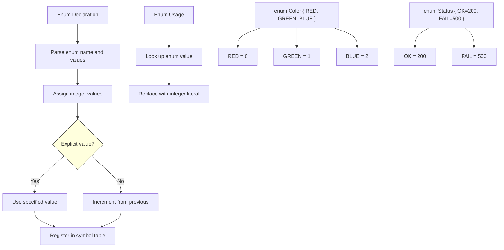

# Lesson 0028: Enums

## Status: ✅ Complete | Phase: Data Structures | Effort: Easy (4-6h)

## Objective

Implement `enum` for named integer constants. Enums are pure
compile-time sugar: each enumerator is replaced with an integer
literal as soon as it's seen, and the enum declaration itself
emits no code.

## Implementation Checklist

- [x] Parse `enum Name { A, B, C }`
- [x] Auto-assign values (0, 1, 2, ...)
- [x] Support explicit values: `A = 10`
- [x] Treat enums as integers
- [x] Test: `enum Color { RED, GREEN, BLUE }; return GREEN;` → 1

## Architecture



## Implementation Details

The core trick: enum constants are **resolved at parse time** into
integer literals. The codegen never has to know that an `int` came
from an enum — it sees an `IntegerLiteralNode` and emits `mov $N,
%rax` like any other integer.

### Parser — tracking enum values

`parse_enum_decl()` walks the `{ ... }` list, maintaining a running
counter. For each name, it either uses the explicitly assigned
expression's value (if it's an integer literal) or increments the
counter. The mapping `name → value` is stored in the parser's
`enum_constants_` map (`src/parser.cpp:841-883`):

```cpp
// src/parser.cpp:841-883
ASTPtr Parser::parse_enum_decl() {
    std::string name;
    int name_line = peek().line, name_col = peek().column;
    if (check(TokenType::IDENTIFIER)) {
        name = peek().value;
        advance();
    }

    auto enum_decl = std::make_unique<EnumDeclNode>(
        name, name_line, name_col);

    expect(TokenType::LBRACE);

    long long value = 0;
    while (!check(TokenType::RBRACE) && !is_at_end()) {
        const Token& val_token = peek();
        std::string val_name = val_token.value;
        advance();

        ASTPtr val_expr = nullptr;
        if (match(TokenType::ASSIGN)) {
            val_expr = parse_assignment();
            if (val_expr && val_expr->type == NodeType::INTEGER_LITERAL) {
                value = static_cast<IntegerLiteralNode*>(val_expr.get())->value;
            }
        }

        // Store enum constant for later resolution
        enum_constants_[val_name] = value;

        auto enum_val = std::make_unique<EnumValueNode>(
            val_name, std::move(val_expr), val_token.line, val_token.column);
        enum_decl->values.push_back(std::move(enum_val));

        match(TokenType::COMMA); // optional trailing comma
        value++;
    }

    expect(TokenType::RBRACE);
    expect(TokenType::SEMICOLON);

    return std::move(enum_decl);
}
```

### Identifier resolution at use site

When the parser encounters an identifier in expression position, it
first checks `enum_constants_` and, if found, substitutes an
`IntegerLiteralNode` directly. No codegen work required
(`src/parser.cpp:1982-1984`):

```cpp
// src/parser.cpp:1982-1984
// Check if this is an enum constant
if (enum_constants_.count(tok.value)) {
    return std::make_unique<IntegerLiteralNode>(
        enum_constants_[tok.value], tok.line, tok.column);
}
```

### Codegen — no-op

`visit(EnumDeclNode&)` is intentionally empty: the enum
declaration exists only to populate `enum_constants_` at parse
time, which is long past by the time codegen runs
(`src/codegen.cpp:618-621`):

```cpp
// src/codegen.cpp:618-621
void CodeGenerator::visit(EnumDeclNode& node) {
    // Enum declarations don't generate code
    // Values are resolved at parse time via enum_constants_ in the parser
}
```

## Example

```c
// src/example.c
enum Color { RED, GREEN, BLUE };

int main() {
    enum Color c = GREEN;
    return c;
}
```

The parser sees `GREEN`, looks it up in `enum_constants_` (finds
`1`), and produces an `IntegerLiteralNode(1)`. Codegen emits
`mov $1, %rax` to store into `c`, and on the return path
`movl %eax, %eax` (or similar) to put it in the return register.
End-to-end: the enum is gone by codegen time.

## Source Code References

| Component | File | Lines | Description |
|-----------|------|-------|-------------|
| Enum keyword | `src/lexer.cpp` | `112` | Maps `enum` → `TokenType::KW_ENUM` |
| Enum type specifier | `src/parser.cpp` | `~200-212` | Builds `"enum "` prefix in `parse_type_specifier` |
| Enum dispatch | `src/parser.cpp` | `489-513` | Routes `enum` keyword to `parse_enum_decl` or anonymous parser |
| `parse_enum_decl` | `src/parser.cpp` | `841-883` | Walks values, runs counter, fills `enum_constants_` |
| Enum constant resolution | `src/parser.cpp` | `1982-1984` | Identifier → `IntegerLiteralNode` at use site |
| `EnumDeclNode` AST | `src/ast.h` | `273-280` | Holds enum name and value list |
| `EnumValueNode` AST | `src/ast.h` | `282-289` | Per-enumerator node |
| `visit(EnumDeclNode)` | `src/codegen.cpp` | `618-621` | No-op (already resolved at parse time) |
