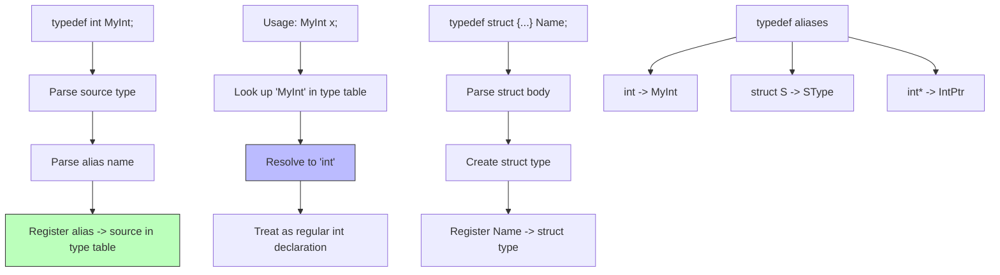

# Lesson 0029: typedef

## Status: 📋 Planned | Phase: Data Structures | Effort: Medium (6-8h)

## Objective

Implement type aliases.

## Implementation Checklist

- [ ] Parse `typedef int MyInt;`
- [ ] Parse `typedef struct {...} Name;`
- [ ] Register typedef names in symbol table
- [ ] Recognize typedef'd names as type specifiers
- [ ] Test: `typedef int MyInt; MyInt x = 42; return x;` → 42

## Architecture

