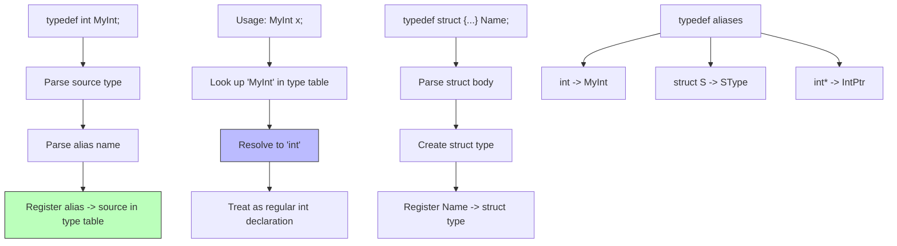

# Lesson 0029: typedef

## Status: ✅ Complete | Phase: Data Structures | Effort: Medium (6-8h)

## Objective

Implement type aliases. The parser treats a typedef name as a type
specifier, and the codegen records the alias so it can be displayed
in error messages and recovered via `get_type_size`.

## Implementation Checklist

- [x] Parse `typedef int MyInt;`
- [x] Parse `typedef struct {...} Name;`
- [x] Parse function-pointer typedefs: `typedef int (*fp)(int);`
- [x] Register typedef names in parser's `typedef_names_` set
- [x] Recognize typedef'd names as type specifiers
- [x] Test: `typedef int MyInt; MyInt x = 42; return x;` → 42

## Architecture



## Implementation Details

The core trick: typedef is **textual substitution at the type
level**, with a small registry that lets the parser treat
typedef'd names like built-in type names.

### Parser — typedef dispatch

`parse_declaration()` checks for `KW_TYPEDEF` first and routes to
`parse_typedef_decl()` (`src/parser.cpp:515-518`):

```cpp
// src/parser.cpp:515-518
// Handle typedef keyword
if (match(TokenType::KW_TYPEDEF)) {
    return parse_typedef_decl();
}
```

`parse_typedef_decl()` reads a source type, then either a plain
identifier (object-like typedef) or a function-pointer name in
parens (`src/parser.cpp:885-935`). The alias is registered in the
parser's `typedef_names_` set so `is_type_specifier()` will
recognise it later:

```cpp
// src/parser.cpp:885-935  (abridged)
ASTPtr Parser::parse_typedef_decl() {
    std::string source_type = parse_type_specifier();

    std::string alias;
    int alias_line, alias_col;

    if (check(TokenType::IDENTIFIER)) {
        alias_line = peek().line;
        alias_col = peek().column;
        alias = peek().value;
        advance();
    } else if (match(TokenType::LPAREN)) {
        // Function pointer typedef: typedef int (*func_t)(int);
        if (match(TokenType::STAR)) {
            if (!check(TokenType::IDENTIFIER)) { ... }
            alias_line = peek().line; alias_col = peek().column;
            alias = peek().value;
            advance();
            expect(TokenType::RPAREN);
        }
        // ...skip parameter list...
    }
    typedef_names_.insert(alias);
    expect(TokenType::SEMICOLON);
    return std::make_unique<TypedefDeclNode>(
        source_type, alias, alias_line, alias_col);
}
```

### Codegen — alias registry

`visit(TypedefDeclNode&)` is a one-liner: store the alias → source
type mapping in `typedef_map_` for later inspection (used in error
messages and type-size lookups) (`src/codegen.cpp:627-629`):

```cpp
// src/codegen.cpp:627-629
void CodeGenerator::visit(TypedefDeclNode& node) {
    typedef_map_[node.alias] = node.source_type;
}
```

`typedef_map_` is declared in `src/codegen.h:140`:

```cpp
// src/codegen.h:140
// Typedef mappings
std::map<std::string, std::string> typedef_map_;
```

### Usage at variable declaration

When the user writes `MyInt x = 42;`, the parser's
`is_type_specifier()` accepts `MyInt` (because it's in
`typedef_names_`), `parse_type_specifier()` returns the source
type `int`, and the variable is allocated as a normal int. No
special codegen is needed at the use site.

## Example

```c
// src/example.c
typedef int integer;

int main() {
    integer x = 42;
    return x;
}
```

`integer` is registered as a typedef of `int`; the variable
declaration becomes `int x = 42`. The codegen emits
`mov $42, %rax; movl %eax, -4(%rbp)` and the return loads it
back. Same code as a hand-written `int x = 42;`.

## Source Code References

| Component | File | Lines | Description |
|-----------|------|-------|-------------|
| `typedef` keyword | `src/lexer.cpp` | `29, 113` | Mapped to `TokenType::KW_TYPEDEF` |
| `TypedefDeclNode` AST | `src/ast.h` | `291-298` | `source_type` and `alias` strings |
| `accept()` | `src/ast.cpp` | `14` | Dispatches to `visit` |
| Parser dispatch | `src/parser.cpp` | `515-518` | `parse_declaration()` routes `typedef` |
| `parse_typedef_decl` | `src/parser.cpp` | `885-935` | Parses source type + alias, registers name |
| Parser typedef set | `src/parser.h` | `40, 86` | `typedef_names_` declaration |
| `visit(TypedefDeclNode)` | `src/codegen.cpp` | `627-629` | Fills `typedef_map_` |
| `typedef_map_` | `src/codegen.h` | `140` | The alias table |
