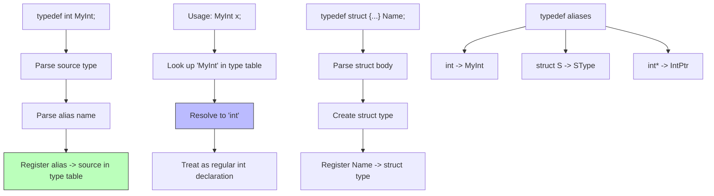

# Lesson 0029: typedef

## Status: ✅ Complete | Phase: Data Structures | Effort: Medium (6-8h)

## Objective

Implement type aliases.

## Implementation Checklist

- [ ] Parse `typedef int MyInt;`
- [ ] Parse `typedef struct {...} Name;`
- [ ] Register typedef names in symbol table
- [ ] Recognize typedef'd names as type specifiers
- [ ] Test: `typedef int MyInt; MyInt x = 42; return x;` → 42

## Architecture

## Implementation Details

| Feature | File | Line(s) | Description |
|---------|------|---------|-------------|
| Lexer keyword | `src/lexer.cpp` | 29, 113 | `typedef` token recognition |
| AST node | `src/ast.h` | 91, 260–266 | `TypedefDeclNode` struct |
| AST accept | `src/ast.cpp` | 14 | `accept()` method |
| Parser entry | `src/parser.cpp` | 370–372 | Dispatches to `parse_typedef_decl()` |
| Parser method | `src/parser.cpp` | 573–592 | Parses source type + alias, registers in `typedef_names_` |
| Parser context | `src/parser.h` | 40, 86 | Declaration and `typedef_names_` set |
| Codegen | `src/codegen.cpp` | 410–412 | Stores alias → source type in `typedef_map_` |
| Codegen map | `src/codegen.h` | 133 | `typedef_map_` member |
