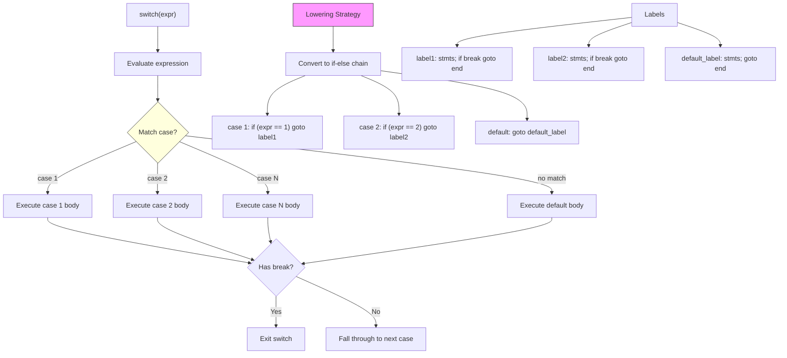

# Lesson 0030: switch/case/default

## Status: 📋 Planned | Phase: Control Flow | Effort: Medium (8-12h)

## Objective

Implement switch statement with case labels.

## Implementation Checklist

- [ ] Parse `switch(expr) { case val: ... default: ... }`
- [ ] Case values must be compile-time constants
- [ ] Implement if-else lowering (simple approach)
- [ ] Implement break inside switch cases
- [ ] Fall-through behavior between cases
- [ ] Test: basic switch with 3 cases + default

## Architecture

