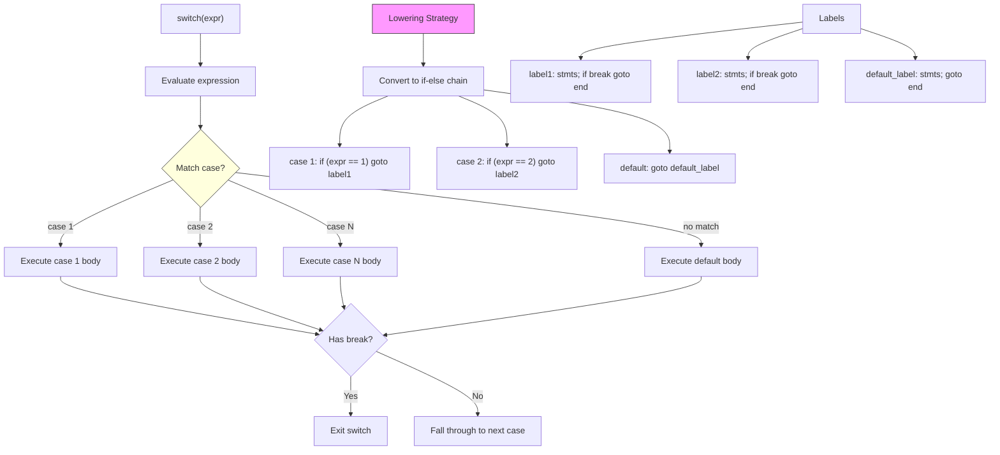

# Lesson 0030: switch/case/default

## Status: 📋 Planned | Phase: Control Flow | Effort: Medium (8-12h)

## Objective

Implement switch statement with case labels.

## Implementation Checklist

- [ ] Parse `switch(expr) { case val: ... default: ... }`
- [ ] Case values must be compile-time constants
- [ ] Implement if-else lowering (simple approach)
- [ ] Implement break inside switch cases
- [ ] Fall-through behavior between cases
- [ ] Test: basic switch with 3 cases + default

## Architecture

## Implementation Details

| Feature | File | Line(s) | Description |
|---------|------|---------|-------------|
| Lexer keywords | `src/lexer.cpp` | 25–27, 109 | `switch`, `case`, `default` tokens |
| AST nodes | `src/ast.h` | 92–94, 269–289 | `SwitchStmtNode`, `CaseLabelNode`, `DefaultLabelNode` |
| AST accept | `src/ast.cpp` | 15–17 | `accept()` methods |
| Parser entry | `src/parser.cpp` | 666–668 | Dispatches to `parse_switch_stmt()` |
| Parser method | `src/parser.cpp` | 816–858 | Parses `switch(expr) { case… default… }` |
| Codegen | `src/codegen.cpp` | 414–464 | If-else lowering with case comparison chain |
| Codegen helpers | `src/codegen.cpp` | 466–471 | Case/default label visitors (no-ops) |
| Codegen context | `src/codegen.h` | 97–98 | `current_case_label_`, `current_switch_end_` |
