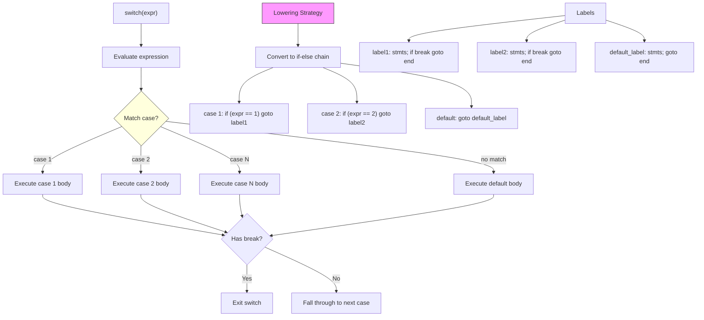

# Lesson 0030: switch/case/default

## Status: ✅ Complete | Phase: Control Flow | Effort: Medium (8-12h)

## Objective

Implement switch statement with case labels. The codegen lowers the
switch to a chain of `cmp`/`je` jumps — no jump table, no density
optimisation, but correct and simple.

## Implementation Checklist

- [x] Parse `switch(expr) { case val: ... default: ... }`
- [x] Case values must be compile-time constants
- [x] If-else lowering (chain of `cmp`/`je`)
- [x] `break` inside switch cases (see lesson 0032)
- [x] Fall-through behavior between cases
- [x] Test: basic switch with 3 cases + default

## Architecture



## Implementation Details

The core trick: a single linear scan over the cases, comparing the
condition against each case value with `cmp` + `je`, with each case
body preceded by a fresh label. After the comparison chain comes a
`jmp end_label` (or `jmp default_label`), and each body has a
`break` lowered to `jmp current_switch_end_` (set in the second
pass).

### Codegen — if-else lowering

`visit(SwitchStmtNode&)` does two passes: first it generates the
comparison chain, then it emits the bodies
(`src/codegen.cpp:631-681`):

```cpp
// src/codegen.cpp:631-681
void CodeGenerator::visit(SwitchStmtNode& node) {
    std::string end_label = new_label("switch_end");
    std::string default_label = new_label("switch_default");
    bool has_default = false;

    // Evaluate condition
    dispatch(node.condition.get());
    emit("push %rax");

    // First pass: generate all comparisons as a chain of jumps
    std::vector<std::pair<std::string, ASTPtr>> case_bodies;
    for (auto& case_ast : node.cases) {
        if (case_ast->type == NodeType::CASE_LABEL) {
            auto* case_node = static_cast<CaseLabelNode*>(case_ast.get());
            std::string case_label = new_label("case");

            // Compare case value with switch value
            dispatch(case_node->value.get());
            emit("pop %rcx");
            emit("push %rcx");
            emit("cmp %rax, %rcx");
            emit("je " + case_label);

            case_bodies.push_back({case_label, std::move(case_node->body)});
        } else if (case_ast->type == NodeType::DEFAULT_LABEL) {
            has_default = true;
            auto* default_node = static_cast<DefaultLabelNode*>(case_ast.get());
            case_bodies.push_back({default_label, std::move(default_node->body)});
        }
    }

    // Jump to default or end
    if (has_default) {
        emit("jmp " + default_label);
    } else {
        emit("jmp " + end_label);
    }

    emit("pop %rax"); // pop switch value

    // Second pass: emit case bodies with labels
    current_switch_end_ = end_label;
    for (auto& [label, body] : case_bodies) {
        emit_label(label);
        if (body) {
            dispatch(body.get());
        }
    }

    emit_label(end_label);
}
```

A few things to notice:

1. The condition is pushed once and reused for every comparison
   (each comparison does a `pop %rcx; push %rcx`).
2. `case_bodies` is a vector of `(label, body)` pairs. We move the
   body out of the AST during the first pass so the second pass
   can dispatch each body independently.
3. `current_switch_end_` is set before emitting bodies so that any
   `break` inside them emits `jmp end_label`
   (`src/codegen.cpp:870-876`).

### Parser — case collection

`parse_switch_stmt()` collects `case X:` and `default:` labels as
`CaseLabelNode` / `DefaultLabelNode` children of the `SwitchStmtNode`
(`src/parser.cpp:1298-1340`). For each `case`, the body consists of
all subsequent statements until the next `case`, `default`, or `}`.
Statements that appear before any `case` are wrapped in a synthetic
`DefaultLabelNode` (lines 1328-1334).

## Example

```c
// src/example.c
int main() {
    int x = 2;
    switch (x) {
        case 1: return 10;
        case 2: return 20;
        default: return 0;
    }
}
```

The codegen produces (approximately):

```asm
    # x = 2
    mov $2, %rax
    movl %eax, -4(%rbp)
    # switch(x)
    mov -4(%rbp), %rax
    push %rax                # save x
    # case 1:
    mov $1, %rax
    pop %rcx
    push %rcx
    cmp %rax, %rcx
    je .Lcase_0
    # case 2:
    mov $2, %rax
    pop %rcx
    push %rcx
    cmp %rax, %rcx
    je .Lcase_1
    jmp .Lswitch_default     # fall through to default
    pop %rax
    # body of case 1
.Lcase_0:
    mov $10, %rax
    jmp .Lswitch_end
    # body of case 2
.Lcase_1:
    mov $20, %rax
    jmp .Lswitch_end
    # default body
.Lswitch_default:
    mov $0, %rax
.Lswitch_end:
```

## Source Code References

| Component | File | Lines | Description |
|-----------|------|-------|-------------|
| `switch`/`case`/`default` keywords | `src/lexer.cpp` | `25-27, 109` | Token types |
| AST nodes | `src/ast.h` | `92-94, 300-322` | `SwitchStmtNode`, `CaseLabelNode`, `DefaultLabelNode` |
| `accept()` methods | `src/ast.cpp` | `15-17` | Visitor dispatch |
| Parser dispatch | `src/parser.cpp` | `1009-1011` | Routes `switch` token |
| `parse_switch_stmt` | `src/parser.cpp` | `1298-1340` | Builds case list |
| `visit(SwitchStmtNode)` | `src/codegen.cpp` | `631-681` | If-else lowering |
| `visit(CaseLabelNode)` | `src/codegen.cpp` | `683-685` | No-op (handled by switch) |
| `visit(DefaultLabelNode)` | `src/codegen.cpp` | `687-689` | No-op (handled by switch) |
| `current_switch_end_` | `src/codegen.h` | `103-104` | Where `break` jumps inside switch |
