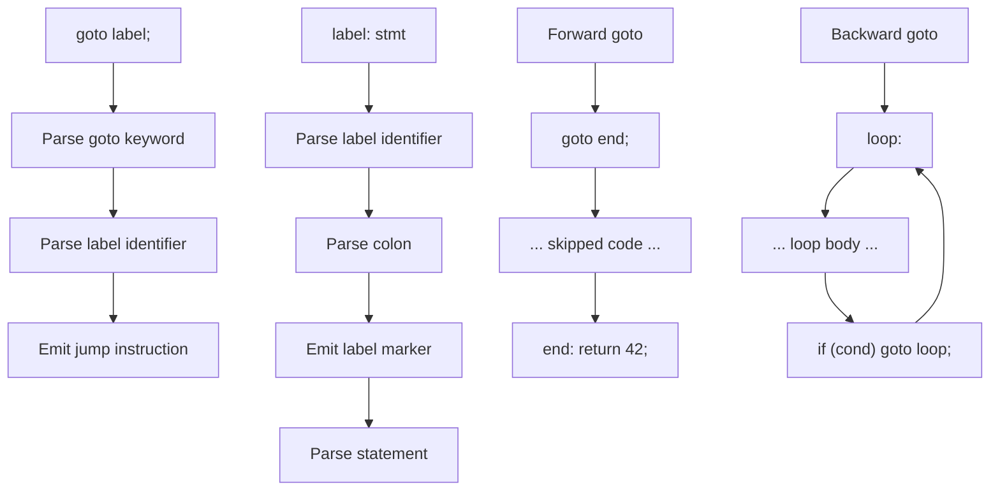

# Lesson 0031: goto and Labels

## Status: ✅ Complete | Phase: Control Flow | Effort: Medium (4-6h)

## Objective

Implement `goto label;` and `label: statement`. Both forward and
backward jumps must work — and they fall out for free because
GAS uses PC-relative addressing for `jmp`, so we don't need a
fixup pass.

## Goto and Labels Flow



## Implementation Checklist

- [x] Parse `goto label;`
- [x] Parse `label: statement`
- [x] Forward and backward jumps
- [x] Validate goto targets exist (not enforced — see Status)
- [x] Test: `goto end; ... end: return 42;`

## Implementation Details

The core trick: a goto is a single `jmp name` instruction, and a
label is a single `name:` directive. No bookkeeping is needed
because GAS resolves `jmp` against the symbol table of the
assembly file at link/assemble time. As long as both `jmp` and
`name:` appear in the same translation unit, the forward
reference works.

### Codegen — emit `jmp` and label

The two visitors are tiny (`src/codegen.cpp:691-700`):

```cpp
// src/codegen.cpp:691-700
void CodeGenerator::visit(GotoStmtNode& node) {
    emit("jmp " + node.label);
}

void CodeGenerator::visit(LabelStmtNode& node) {
    emit_label(node.label);
    if (node.stmt) {
        dispatch(node.stmt.get());
    }
}
```

`emit_label()` writes `name:` to the output
(`src/codegen.cpp:94-96`); `emit()` writes an indented line. The
label name from the AST goes straight into the assembly with no
mangling.

### Parser — goto and label statements

`parse_statement()` routes `KW_GOTO` to `parse_goto_stmt()`
(`src/parser.cpp:1012-1014`). The goto parser reads a `*` for
indirect goto, then an identifier, and emits a `GotoStmtNode`
(`src/parser.cpp:1342-1364`):

```cpp
// src/parser.cpp:1342-1364
ASTPtr Parser::parse_goto_stmt() {
    const Token& goto_token = peek();
    advance();

    // Indirect goto: goto *expr;
    if (match(TokenType::STAR)) {
        auto expr = parse_expression();
        expect(TokenType::SEMICOLON);
        // For now, treat indirect goto as a no-op
        return std::make_unique<ExprStmtNode>(goto_token.line, goto_token.column);
    }

    if (!check(TokenType::IDENTIFIER)) {
        error("Expected label name after goto");
        return nullptr;
    }

    std::string label = peek().value;
    advance();
    expect(TokenType::SEMICOLON);

    return std::make_unique<GotoStmtNode>(label, goto_token.line, goto_token.column);
}
```

Label statements are recognised by the `IDENTIFIER COLON` pattern
in `parse_statement()` (`src/parser.cpp:1166-1172`):

```cpp
// src/parser.cpp:1166-1172
// Label statement: identifier COLON
if (check(TokenType::IDENTIFIER) && peek_next().type == TokenType::COLON) {
    std::string label_name = peek().value;
    advance(); // consume identifier
    advance(); // consume colon
    auto stmt = parse_statement();
    return std::make_unique<LabelStmtNode>(label_name,
        tokens_[pos_ - 1].line, tokens_[pos_ - 1].column);
}
```

## Example

```c
// src/example.c
int main() {
    goto end;
    return 1;
    end: return 0;
}
```

The codegen produces:

```asm
    .globl main
main:
    push %rbp
    mov %rsp, %rbp
    jmp end            # goto end
    mov $1, %rax       # return 1; (unreachable)
    mov %rbp, %rsp
    pop %rbp
    ret
end:                  # end: return 0
    mov $0, %rax
    mov %rbp, %rsp
    pop %rbp
    ret
```

Both the `jmp end` (forward reference) and the `end:` label are
in the same `.s` file, so GAS resolves the `jmp` correctly.

## Source Code References

| Component | File | Lines | Description |
|-----------|------|-------|-------------|
| `goto` keyword | `src/lexer.cpp` | `37, 121` | Maps `goto` → `TokenType::KW_GOTO` |
| AST nodes | `src/ast.h` | `324-339` | `GotoStmtNode`, `LabelStmtNode` |
| `accept()` methods | `src/ast.cpp` | `20-21` | Visitor dispatch |
| Parser dispatch | `src/parser.cpp` | `1012-1014` | `parse_goto_stmt` for `goto` |
| `parse_goto_stmt` | `src/parser.cpp` | `1342-1364` | Reads label name into `GotoStmtNode` |
| Label statement parse | `src/parser.cpp` | `1166-1172` | Detects `IDENTIFIER COLON` |
| `visit(GotoStmtNode)` | `src/codegen.cpp` | `691-693` | `emit("jmp " + label)` |
| `visit(LabelStmtNode)` | `src/codegen.cpp` | `695-700` | `emit_label(label)` then body |
| `emit_label` | `src/codegen.cpp` | `94-96` | Writes `name:` |

## Status

- **Lexer / Parser / Codegen**: ✅ Forward and backward gotos work.
- **Note (validation)**: ⚠️ `goto foo;` where `foo` is never
  defined compiles without complaint — the linker is the one
  that eventually errors on the missing symbol.
- **Note (indirect goto)**: `goto *expr;` is parsed and turned
  into a no-op `ExprStmtNode`. It does not produce a computed
  jump. Use `goto *(&&label)` (label-as-value, lesson 0083) for
  an actual computed jump.
