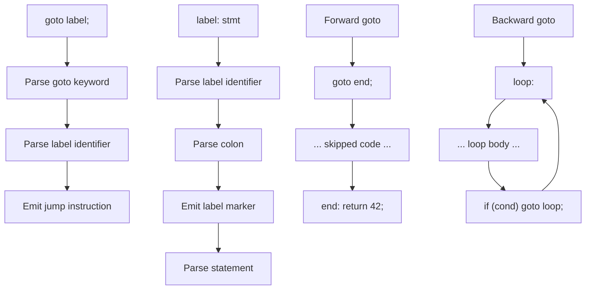

# Lesson 0031: goto and Labels

## Status: 📋 Planned | Phase: Control Flow | Effort: Medium (4-6h)

## Objective

Implement `goto label;` and `label: statement`.

## Goto and Labels Flow

## Implementation Checklist

- [ ] Parse `goto label;`
- [ ] Parse `label: statement`
- [ ] Forward and backward jumps
- [ ] Validate goto targets exist
- [ ] Test: `goto end; ... end: return 42;`
