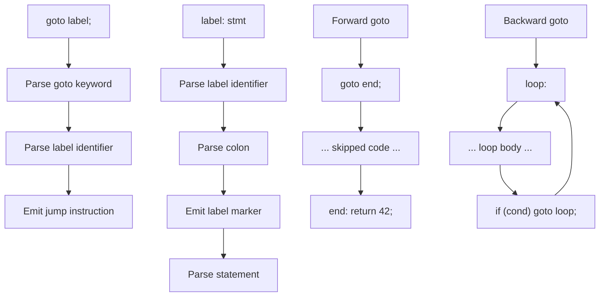

# Lesson 0031: goto and Labels

## Status: 📋 Planned | Phase: Control Flow | Effort: Medium (4-6h)

## Objective

Implement `goto label;` and `label: statement`.

## Goto and Labels Flow

## Implementation Checklist

- [ ] Parse `goto label;`
- [ ] Parse `label: statement`
- [ ] Forward and backward jumps
- [ ] Validate goto targets exist
- [ ] Test: `goto end; ... end: return 42;`

## Implementation Details

| Feature | File | Line(s) | Description |
|---------|------|---------|-------------|
| Lexer keywords | `src/lexer.cpp` | 37, 121 | `goto` token recognition |
| AST nodes | `src/ast.h` | 293–308 | `GotoStmtNode`, `LabelStmtNode` structs |
| AST accept | `src/ast.cpp` | 20–21 | `accept()` methods |
| Parser entry | `src/parser.cpp` | 669–671 | Dispatches to `parse_goto_stmt()` |
| Goto parser | `src/parser.cpp` | 860–874 | Parses `goto label;` |
| Label parser | `src/parser.cpp` | 693–700 | Parses `label: statement` |
| Codegen goto | `src/codegen.cpp` | 474–476 | Emits `jmp label` |
| Codegen label | `src/codegen.cpp` | 478–483 | Emits label marker, dispatches body |
