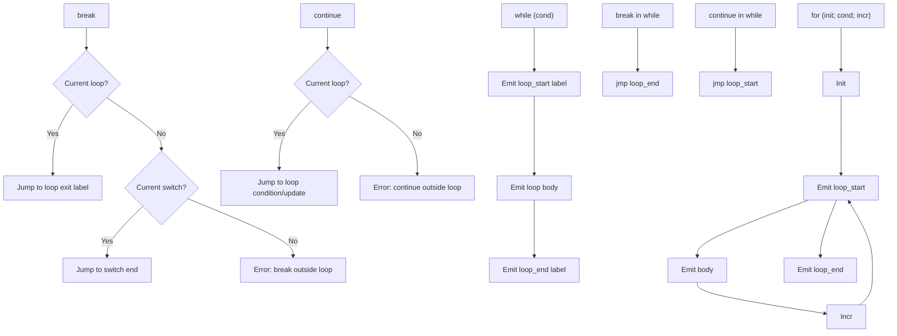

# Lesson 0032: break/continue (Proper)

## Status: 📋 Planned | Phase: Control Flow | Effort: Easy (2-3h)

## Objective

Implement proper break/continue with loop context tracking.

## Break and Continue Flow

## Implementation Checklist

- [ ] Track current loop in codegen
- [ ] break → jump to loop exit label
- [ ] continue → jump to loop condition/update
- [ ] break in switch → jump to switch end
- [ ] Error on break/continue outside loop
- [ ] Test: nested loop break exits innermost only

## Implementation Details

| Feature | File | Line(s) | Description |
|---------|------|---------|-------------|
| Lexer keywords | `src/lexer.cpp` | 22–23, 101–102 | `break`, `continue` tokens |
| AST nodes | `src/ast.h` | 104–105, 367–373 | `BreakStmtNode`, `ContinueStmtNode` |
| AST accept | `src/ast.cpp` | 27–28 | `accept()` methods |
| Parser | `src/parser.cpp` | 672–681 | Parses `break;` and `continue;` |
| Codegen break | `src/codegen.cpp` | 630–636 | Jumps to `current_switch_end_` or `current_loop_end_` |
| Codegen continue | `src/codegen.cpp` | 638–642 | Jumps to `current_loop_start_` |
| Loop context (while) | `src/codegen.cpp` | 542–545, 560–561 | Saves/restores loop labels |
| Loop context (for) | `src/codegen.cpp` | 594–597, 624 | Saves/restores loop labels |
| Context members | `src/codegen.h` | 100–102 | `current_loop_start_`, `current_loop_end_` |
