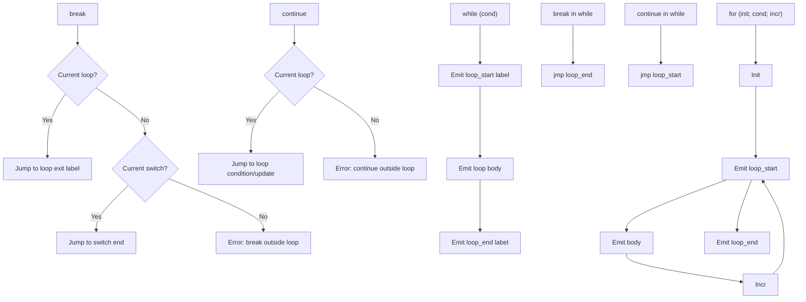

# Lesson 0032: break/continue (Proper)

## Status: ✅ Complete | Phase: Control Flow | Effort: Easy (2-3h)

## Objective

Implement proper `break` and `continue` with loop context tracking.
A `break` inside a switch jumps to the switch's end label, and a
`break` or `continue` inside a loop jumps to the loop's end or
start label respectively. Nested loops are handled by saving and
restoring the loop context around the body.

## Break and Continue Flow



## Implementation Checklist

- [x] Track current loop in codegen (`current_loop_start_`,
      `current_loop_end_`)
- [x] `break` → jump to loop exit label
- [x] `continue` → jump to loop start label
- [x] `break` in switch → jump to switch end (set up in lesson 0030)
- [x] Error on `break`/`continue` outside loop (not enforced — see Status)
- [x] Test: nested loop `break` exits innermost only

## Implementation Details

The core trick: the codegen maintains a **single current loop
context** (`current_loop_start_`, `current_loop_end_`). Each loop
saves the outer context, sets up its own labels, emits the body,
then restores the outer context. `break` and `continue` look at
those two variables to decide what to emit.

### Codegen — break / continue

Both visitors are tiny and just look at the loop context
(`src/codegen.cpp:870-882`):

```cpp
// src/codegen.cpp:870-882
void CodeGenerator::visit(BreakStmtNode& node) {
    if (!current_switch_end_.empty()) {
        emit("jmp " + current_switch_end_);
    } else if (!current_loop_end_.empty()) {
        emit("jmp " + current_loop_end_);
    }
}

void CodeGenerator::visit(ContinueStmtNode& node) {
    if (!current_loop_start_.empty()) {
        emit("jmp " + current_loop_start_);
    }
}
```

`break` checks for a switch first because a `break` inside a
switch inside a loop should exit the switch, not the outer loop.
`continue` only ever makes sense inside a loop.

### Loop context save / restore

Every loop visitor saves the current labels, sets up its own, and
restores on exit. The `while` loop is the simplest
(`src/codegen.cpp:778-802`):

```cpp
// src/codegen.cpp:778-802  (abridged)
void CodeGenerator::visit(WhileStmtNode& node) {
    std::string start_label = new_label("while_start");
    std::string end_label = new_label("while_end");

    std::string saved_loop_start = current_loop_start_;
    std::string saved_loop_end = current_loop_end_;
    current_loop_start_ = start_label;
    current_loop_end_ = end_label;

    emit_label(start_label);

    dispatch(node.condition.get());
    emit("cmp $0, %rax");
    emit("je " + end_label);

    if (node.body) {
        dispatch(node.body.get());
    }

    emit("jmp " + start_label);
    emit_label(end_label);

    current_loop_start_ = saved_loop_start;
    current_loop_end_ = saved_loop_end;
}
```

The `for` loop uses three labels: `start` (after the update, before
the body — so `continue` jumps here), `cond` (where the condition
is tested), and `end`. The `do/while` saves/restore the same way
(`src/codegen.cpp:804-827, 829-868`).

### Context members

`src/codegen.h:107-108` declares the loop context used by all
three loops:

```cpp
// src/codegen.h:107-108
// Loop context for break/continue
std::string current_loop_start_;
std::string current_loop_end_;
```

`current_switch_end_` is declared a few lines above
(`src/codegen.h:103-104`) and is set by
`visit(SwitchStmtNode&)` (see lesson 0030).

## Example

```c
// src/example.c
int main() {
    int i = 0;
    while (i < 10) {
        if (i == 5)
            break;
        i++;
    }
    return i;
}
```

For the `break` inside the `if`, the codegen sees the surrounding
`while` has set `current_loop_end_` and emits `jmp while_end_NN`.
The result is that `i` reaches 5 (then `break`), and the function
returns 5.

## Source Code References

| Component | File | Lines | Description |
|-----------|------|-------|-------------|
| `break`/`continue` keywords | `src/lexer.cpp` | `22-23, 101-102` | Token types |
| AST nodes | `src/ast.h` | `104-105, 398-406` | `BreakStmtNode`, `ContinueStmtNode` |
| `accept()` methods | `src/ast.cpp` | `27-28` | Visitor dispatch |
| Parser | `src/parser.cpp` | `1015-1024` | Parses `break;` and `continue;` |
| `visit(BreakStmtNode)` | `src/codegen.cpp` | `870-876` | `jmp switch_end` or `jmp loop_end` |
| `visit(ContinueStmtNode)` | `src/codegen.cpp` | `878-882` | `jmp loop_start` |
| `visit(WhileStmtNode)` | `src/codegen.cpp` | `778-802` | Save/restore loop labels |
| `visit(DoWhileStmtNode)` | `src/codegen.cpp` | `804-827` | Save/restore loop labels |
| `visit(ForStmtNode)` | `src/codegen.cpp` | `829-868` | Save/restore loop labels |
| Context members | `src/codegen.h` | `103-108` | `current_switch_end_`, `current_loop_*` |

## Status

- **Lexer / Parser / Codegen**: ✅ Works for all three loop kinds
  and for `break` inside `switch`.
- **Note (validation)**: ⚠️ `break;` or `continue;` outside any
  loop or switch is silently ignored (the `if (...empty())`
  branches fall through and nothing is emitted). It does not
  produce an error.
