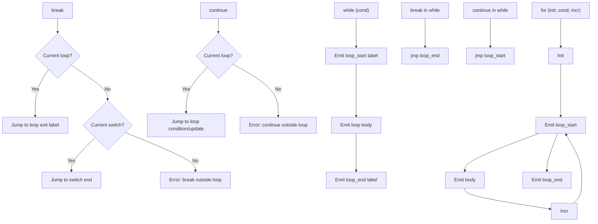

# Lesson 0032: break/continue (Proper)

## Status: 📋 Planned | Phase: Control Flow | Effort: Easy (2-3h)

## Objective

Implement proper break/continue with loop context tracking.

## Break and Continue Flow

## Implementation Checklist

- [ ] Track current loop in codegen
- [ ] break → jump to loop exit label
- [ ] continue → jump to loop condition/update
- [ ] break in switch → jump to switch end
- [ ] Error on break/continue outside loop
- [ ] Test: nested loop break exits innermost only
