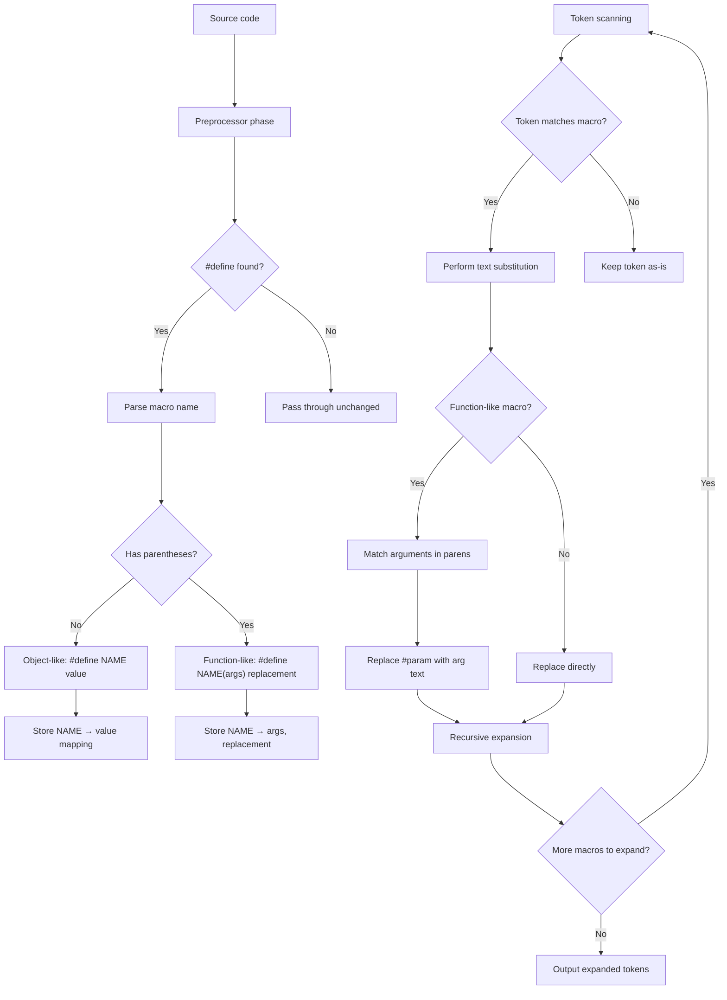

# Lesson 0033: Preprocessor Macros

## Status: 📋 Planned | Phase: Preprocessor | Effort: Medium (8-12h)

## Objective

Implement `#define` for object-like and function-like macros.

## Macro Expansion Flow

## Implementation Checklist

- [ ] Add preprocessor phase to compilation pipeline
- [ ] Parse `#define NAME value` (object-like)
- [ ] Parse `#define NAME(args) replacement` (function-like)
- [ ] Token-level replacement
- [ ] Handle `#undef NAME`
- [ ] Recursive expansion
- [ ] Test: `#define PI 3.14` then `return PI;`
