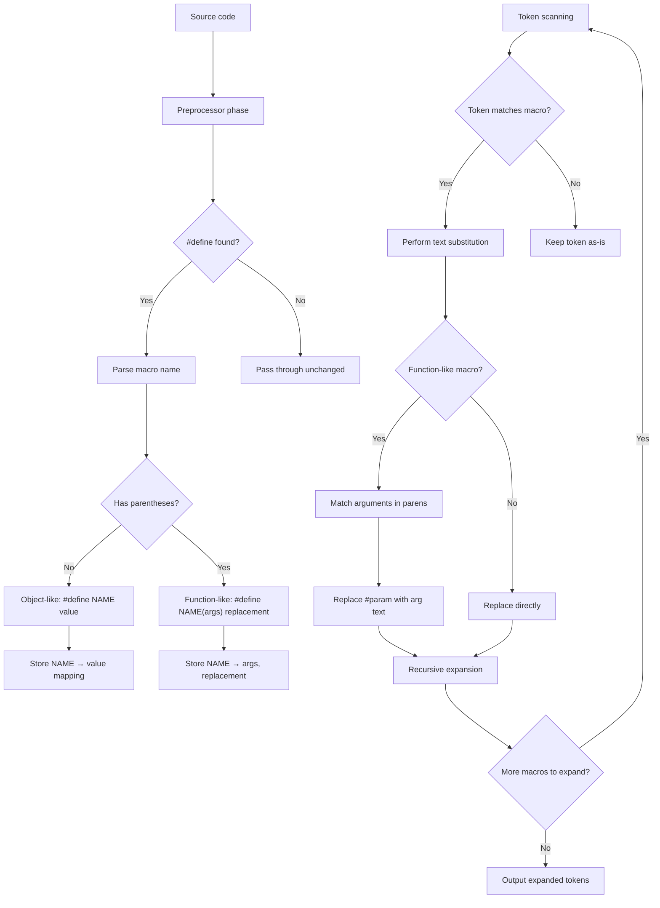

# Lesson 0033: Preprocessor Macros

## Status: ✅ Complete | Phase: Preprocessor | Effort: Medium (8-12h)

## Objective

Implement `#define` for object-like and function-like macros, plus
`#undef`, `#error`, and stringification (`#`) and token-pasting
(`##`). Macro expansion happens at the **textual level** before the
lexer sees the source.

## Macro Expansion Flow



## Implementation Checklist

- [x] Add preprocessor phase to compilation pipeline
  (`src/compiler.cpp:36-43`)
- [x] Parse `#define NAME value` (object-like)
- [x] Parse `#define NAME(args) replacement` (function-like)
- [x] Token-level replacement
- [x] Handle `#undef NAME`
- [x] Recursive expansion (re-enters `expand_macros` on arguments)
- [x] Stringification (`#param` → `"param-value"`)
- [x] Token pasting (`a##b` → `ab`) — see lesson 0079 for
  full details
- [x] Built-in macros: `__STDC__`, `__STDC_VERSION__`, `NULL`,
      `true`, `false`, ...
- [x] `#error "msg"` aborts compilation
- [x] Test: `#define PI 3` then `return PI;` works

## Implementation Details

The core trick: the preprocessor runs **before** the lexer. It
walks the input line by line, dispatches directive lines (`#...`)
to handlers, and runs every other line through `expand_macros()`
which scans for identifier tokens and substitutes registered
macro bodies.

### Directive dispatch

`Preprocessor::process()` is the entry point. For each line that
starts with `#`, the directive name is extracted and the matching
handler is called. Object-like and function-like `#define`s are
both handled by `handle_define` (`src/preprocessor.cpp:20-202`):

```cpp
// src/preprocessor.cpp:95-151 (abridged — directive dispatch)
if (dir_name == "include") {
    handle_include(dir_args);
    if (has_error()) return "";
    // ...read file and recurse...
} else if (dir_name == "define") {
    handle_define(dir_args);
} else if (dir_name == "undef") {
    handle_undef(dir_args);
} else if (dir_name == "error") {
    handle_error(dir_args);
    return "";
} else if (dir_name == "pragma") {
    handle_pragma(dir_args);
} else if (dir_name == "line") {
    // #line directive - ignore for now
} else if (dir_name == "embed") {
    output += handle_embed(dir_args) + "\n";
} else {
    // Unknown directive - pass through
    output += line + "\n";
}
```

### Parsing the macro body

`handle_define` distinguishes object-like from function-like by
looking for `(` immediately after the name. The body text is
stored verbatim, and the parameter list (if any) is split
(`src/preprocessor.cpp:400-443`):

```cpp
// src/preprocessor.cpp:400-443 (abridged)
void Preprocessor::handle_define(const std::string& args) {
    size_t space = args.find_first_of(" \t(");
    std::string name = args.substr(0, space);

    if (args[space] == '(') {
        // Function-like macro
        size_t close = args.find(')', space);
        std::string params_str = args.substr(space + 1, close - space - 1);
        std::vector<std::string> params = split_args(params_str);
        bool is_variadic = false;
        if (!params.empty() && params.back() == "...") {
            is_variadic = true;
            params.pop_back();
        }
        std::string body = args.substr(close + 1);
        Macro macro(name, body, true, is_variadic);
        macro.params = params;
        macros_[name] = macro;
    } else {
        // Object-like macro
        std::string body = args.substr(space + 1);
        macros_[name] = Macro(name, body);
    }
}
```

### Macro expansion at the use site

`expand_macros()` walks the input character by character, skipping
over string/char literals and comments. When it hits an
identifier, it looks it up in `macros_` and either substitutes
the body (object-like) or parses an argument list and calls
`expand_macro_call` (function-like)
(`src/preprocessor.cpp:204-326`):

```cpp
// src/preprocessor.cpp:251-317 (abridged — identifier dispatch)
if (std::isalpha(text[i]) || text[i] == '_') {
    size_t j = i;
    while (j < text.size() && (std::isalnum(text[j]) || text[j] == '_')) j++;
    std::string ident = text.substr(i, j - i);

    auto it = macros_.find(ident);
    if (it != macros_.end()) {
        const Macro& macro = it->second;
        if (macro.is_function_like) {
            // ...parse (args), call expand_macro_call(macro, args)...
        } else {
            result += macro.body;
            i = j;
            continue;
        }
    }
    result += ident;
    i = j;
    continue;
}
```

`expand_macro_call` (lines 328-393) then handles `#x` (stringify),
`x##y` (paste — basic), and `__VA_ARGS__` (variadic) in addition
to the plain parameter substitution.

### Built-in macros

`process()` populates `__STDC__`, `__STDC_VERSION__`, `NULL`,
`true`, `false`, etc. before walking the source
(`src/preprocessor.cpp:24-32`):

```cpp
// src/preprocessor.cpp:24-32
macros_["__STDC__"] = Macro("__STDC__", "1");
macros_["__STDC_VERSION__"] = Macro("__STDC_VERSION__", "202311L");
macros_["__x86_64__"] = Macro("__x86_64__", "1");
macros_["__linux__"] = Macro("__linux__", "1");
macros_["NULL"] = Macro("NULL", "0");
macros_["true"] = Macro("true", "1");
macros_["false"] = Macro("false", "0");
macros_["__bool_true_false_are_defined"] =
    Macro("__bool_true_false_are_defined", "1");
```

## Example

```c
#define PI 3
#define SQUARE(x) ((x) * (x))
int main() { return SQUARE(PI); }
```

The preprocessor turns this into:

```c
int main() { return ((3) * (3)); }
```

`PI` is object-like (just `3`); `SQUARE(PI)` is function-like,
so the `(x)` is replaced with the argument `PI`, which is then
expanded in the next pass to `3`. The final codegen sees
`return 9;`.

## Source Code References

| Component | File | Lines | Description |
|-----------|------|-------|-------------|
| Preprocessor header | `src/preprocessor.h` | `1-79` | `Preprocessor` class, `Macro` struct |
| `Preprocessor::process` | `src/preprocessor.cpp` | `20-202` | Top-level driver, built-in macros |
| `expand_macros` | `src/preprocessor.cpp` | `204-326` | Identifier-driven substitution |
| `expand_macro_call` | `src/preprocessor.cpp` | `328-393` | Function-like expansion, stringify, paste, `__VA_ARGS__` |
| `handle_define` | `src/preprocessor.cpp` | `400-443` | Object/function-like parsing |
| `handle_undef` | `src/preprocessor.cpp` | `445-450` | Removes a macro |
| `handle_error` | `src/preprocessor.cpp` | `490-493` | Aborts with `#error msg` |
| `split_args` | `src/preprocessor.cpp` | `544-577` | Comma-split respecting nesting |
| Compiler integration | `src/compiler.cpp` | `21-43` | Preprocess → tokenize → parse |

## Status

- **Lexer integration**: ✅ Preprocessor runs first
- **Object-like**: ✅ `#define NAME value`
- **Function-like**: ✅ `#define NAME(args) body`, including variadic `...`
- **`#undef`**: ✅
- **`#error`**: ✅
- **Stringification (`#x`)**: ✅
- **Token pasting (`##`)**: ✅ Basic pasting (see lesson 0079)
- **Recursive expansion**: ✅ Re-enters `expand_macros` on arguments
- **Note (recursion)**: ⚠️ Macro recursion is not detected — a
  self-referential macro will expand until the buffer overflows.
- **Note (no `#pragma` body)**: ⚠️ `#pragma` is parsed and ignored.
