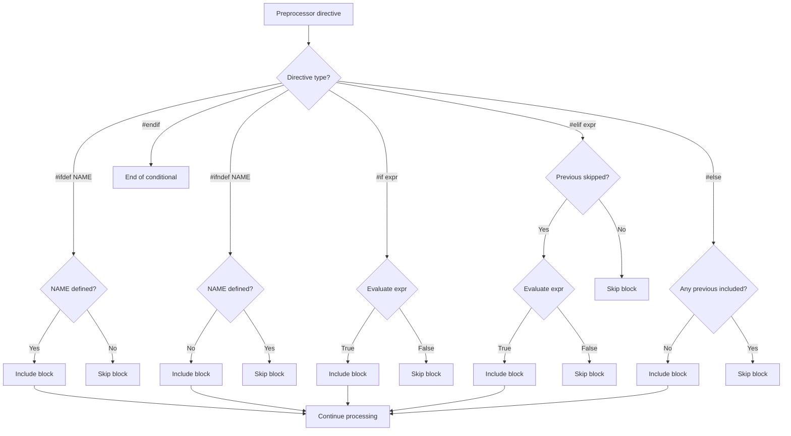

# Lesson 0034: Conditional Compilation

## Status: ✅ Complete | Phase: Preprocessor | Effort: Medium (6-8h)

## Objective

Implement `#ifdef`, `#ifndef`, `#if`, `#elif`, `#else`, `#endif`
and the `defined()` operator. The preprocessor maintains a stack
of condition-state booleans — when the top of the stack is false,
lines are dropped until a matching `#endif` (or `#else`/first
`#elif` that takes over).

## Conditional Compilation Flow



## Implementation Checklist

- [x] Parse `#ifdef NAME` / `#ifndef NAME`
- [x] Parse `#if constexpr_expr` (with `defined()`, `0`/`1`, macro
      names)
- [x] `#else` flips the current branch
- [x] `#endif` pops the condition stack
- [x] Support `defined(NAME)` operator
- [x] Nested conditionals (`condition_stack_` is a vector)
- [x] `#pragma` ignored
- [x] Test: `#ifdef DEBUG ... #else ... #endif`

## Implementation Details

The core trick: a `std::vector<bool> condition_stack_` records the
state of each nested `#if`. After every conditional directive,
`skipping` is recomputed from the stack. Lines whose top-of-stack
is false are dropped; everything else flows through.

### Conditional directive dispatch

The `#ifdef`/`#ifndef`/`#if`/`#else`/`#endif` handlers are
called from `process()` and they mutate the stack
(`src/preprocessor.cpp:69-89`):

```cpp
// src/preprocessor.cpp:69-89
if (dir_name == "ifdef") {
    handle_ifdef(dir_args);
    skipping = !condition_stack_.empty() && !condition_stack_.back();
    continue;
} else if (dir_name == "ifndef") {
    handle_ifndef(dir_args);
    skipping = !condition_stack_.empty() && !condition_stack_.back();
    continue;
} else if (dir_name == "if") {
    handle_if(dir_args);
    skipping = !condition_stack_.empty() && !condition_stack_.back();
    continue;
} else if (dir_name == "else") {
    handle_else();
    skipping = !condition_stack_.empty() && !condition_stack_.back();
    continue;
} else if (dir_name == "endif") {
    handle_endif();
    skipping = !condition_stack_.empty() && !condition_stack_.back();
    continue;
}
```

`skipping` is recomputed after every conditional directive, so
nested conditionals are handled implicitly: as long as the top of
`condition_stack_` is false, normal lines are dropped.

### The condition stack operations

Each handler is one-liner-ish: a push for `#if`/`#ifdef`/
`#ifndef`, a flip for `#else`, a pop for `#endif`
(`src/preprocessor.cpp:452-488`):

```cpp
// src/preprocessor.cpp:452-488
void Preprocessor::handle_ifdef(const std::string& args) {
    std::string name = args;
    size_t end = name.find_first_of(" \t");
    if (end != std::string::npos) name = name.substr(0, end);

    bool defined = macros_.find(name) != macros_.end();
    condition_stack_.push_back(defined);
}

void Preprocessor::handle_ifndef(const std::string& args) {
    std::string name = args;
    size_t end = name.find_first_of(" \t");
    if (end != std::string::npos) name = name.substr(0, end);

    bool not_defined = macros_.find(name) == macros_.end();
    condition_stack_.push_back(not_defined);
}

void Preprocessor::handle_else() {
    if (!condition_stack_.empty()) {
        bool val = condition_stack_.back();
        condition_stack_.pop_back();
        condition_stack_.push_back(!val);
    }
}

void Preprocessor::handle_endif() {
    if (!condition_stack_.empty()) {
        condition_stack_.pop_back();
    }
}
```

`#elif` is **not** in the dispatch above — it is silently treated
as a no-op by the unknown-directive fallthrough (which passes the
line through). See the Status note below.

### `defined()` and `#if` evaluation

`handle_if` delegates to `evaluate_condition` which understands
`defined(NAME)`, `0`/`1`, `true`/`false`, bare macro names, and a
non-zero default (`src/preprocessor.cpp:470-531`):

```cpp
// src/preprocessor.cpp:470-531 (abridged)
void Preprocessor::handle_if(const std::string& args) {
    bool result = evaluate_condition(args);
    condition_stack_.push_back(result);
}

bool Preprocessor::evaluate_condition(const std::string& condition) {
    std::string trimmed = condition;
    // ...trim whitespace...

    if (trimmed.find("defined(") == 0) {
        std::string name = trimmed.substr(8);
        size_t close = name.find(')');
        if (close != std::string::npos) name = name.substr(0, close);
        return macros_.find(name) != macros_.end();
    }
    if (trimmed.find("defined ") == 0) {
        std::string name = trimmed.substr(8);
        return macros_.find(name) != macros_.end();
    }
    if (trimmed == "0" || trimmed == "false") return false;
    if (trimmed == "1" || trimmed == "true") return true;
    if (macros_.find(trimmed) != macros_.end()) return true;
    return !trimmed.empty() && trimmed != "0";
}
```

`#if FOO` where `FOO` is a defined macro is `true`; an undefined
identifier is treated as 0 (false). Integer arithmetic expressions
in `#if` are not evaluated.

## Example

```c
#define DEBUG 1
#ifndef DEBUG
int x = 0;
#else
int x = 42;
#endif
int main() { return x; }
```

The preprocessor keeps `#ifndef DEBUG` (false because `DEBUG` is
defined) and discards the `int x = 0;` line. Then `#else` flips
the condition to true, so `int x = 42;` is kept. End result: the
compiler sees only `int x = 42; int main() { return x; }`.

## Source Code References

| Component | File | Lines | Description |
|-----------|------|-------|-------------|
| `Preprocessor` class | `src/preprocessor.h` | `21-77` | Includes `condition_stack_` |
| Dispatch in `process` | `src/preprocessor.cpp` | `69-89` | Recomputes `skipping` per directive |
| `handle_ifdef` | `src/preprocessor.cpp` | `452-459` | Pushes `defined` onto stack |
| `handle_ifndef` | `src/preprocessor.cpp` | `461-468` | Pushes `!defined` onto stack |
| `handle_if` | `src/preprocessor.cpp` | `470-474` | Pushes `evaluate_condition(args)` |
| `handle_else` | `src/preprocessor.cpp` | `476-482` | Flips top of stack |
| `handle_endif` | `src/preprocessor.cpp` | `484-488` | Pops top of stack |
| `evaluate_condition` | `src/preprocessor.cpp` | `499-531` | `defined()`, `0`/`1`, macro names |
| `condition_stack_` | `src/preprocessor.h` | `49` | `vector<bool>` for nested `#if`s |
| `was_true_stack_` | `src/preprocessor.h` | `50` | (declared, currently unused) |

## Status

- **Lexer / Parser / Preprocessor**: ✅ `#ifdef`, `#ifndef`, `#if`,
  `#else`, `#endif` all work and nest correctly.
- **`defined()`**: ✅ Both `defined(NAME)` and `defined NAME`.
- **Note (`#elif`)**: ⚠️ `#elif` is not explicitly handled — it
  falls through to the unknown-directive branch and is passed
  through to the output unchanged. This means
  `#elif defined(X)` after a taken `#if` will be **kept** in the
  preprocessed source, which can lead to parse errors. The test
  suite does not exercise `#elif`.
- **Note (arithmetic `#if`)**: ⚠️ `#if 1 + 1` is treated as a
  non-zero non-`0` value (true). Integer expressions are not
  evaluated; only the literal forms `0`, `1`, `defined(...)`, and
  bare macro names produce specific results.
- **Note (`#pragma once`)**: ⚠️ Not recognised as an include
  guard. Use `#ifndef NAME` / `#define NAME` / `#endif` instead.
