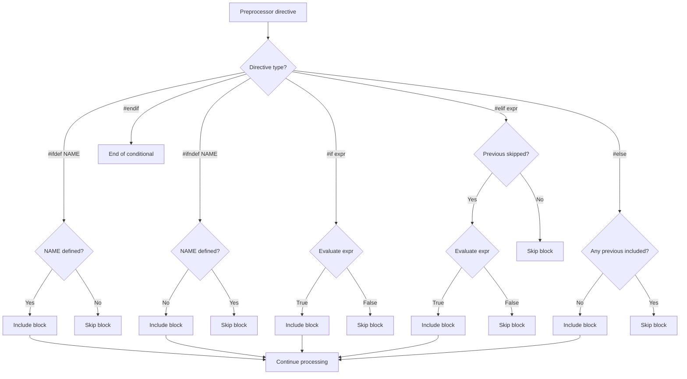

# Lesson 0034: Conditional Compilation

## Status: ✅ Complete | Phase: Preprocessor | Effort: Medium (6-8h)

## Objective

Implement `#ifdef`, `#ifndef`, `#if`, `#elif`, `#else`, `#endif`.

## Conditional Compilation Flow

## Implementation Checklist

- [ ] Parse `#ifdef NAME` / `#ifndef NAME`
- [ ] Parse `#if constexpr_expr`
- [ ] Parse `#elif`, `#else`, `#endif`
- [ ] Support `defined(NAME)` operator
- [ ] Nested conditionals
- [ ] Handle `#pragma once`
- [ ] Test: `#ifdef DEBUG ... #else ... #endif`

## Implementation Details

**Status: Not yet implemented.** No preprocessor infrastructure exists in `src/`. Conditional compilation requires the preprocessor phase first.

| Feature | File | Description |
|---------|------|-------------|
| Conditional evaluator | `src/preprocessor.cpp` *(new)* | `#ifdef`/`#ifndef`/`#if`/`#elif`/`#else`/`#endif` handling |
| Macro table | `src/preprocessor.h` *(new)* | Tracks `defined()` state |
| Lexer tokens | `src/token.h` | `KW_IFDEF`, `KW_IFNDEF`, `KW_IF`, `KW_ELIF`, `KW_ELSE`, `KW_ENDIF` needed |
