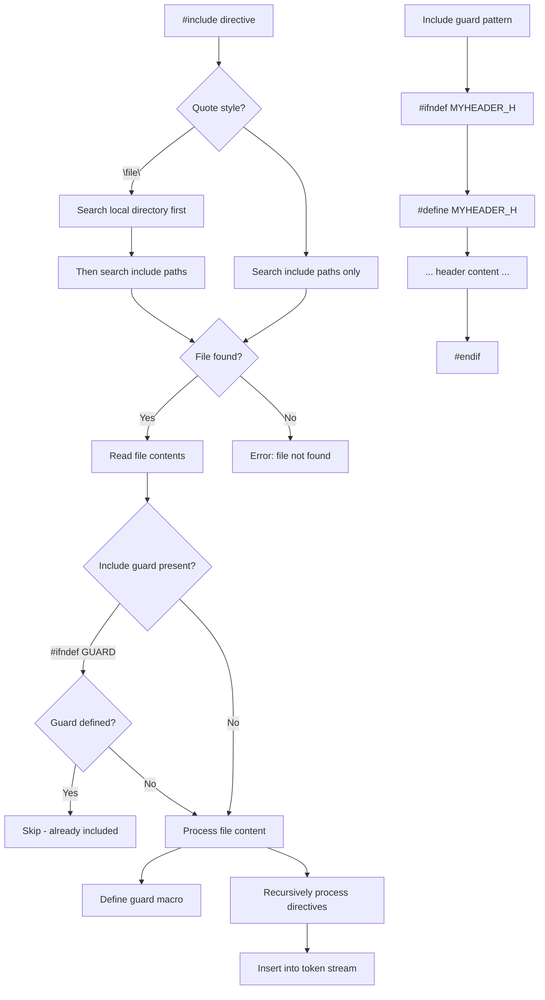

# Lesson 0035: #include Directive

## Status: ✅ Complete | Phase: Preprocessor | Effort: Medium (8-12h)

## Objective

Implement `#include` for header file processing.

## Include Processing Flow

## Implementation Checklist

- [ ] Parse `#include <file>` and `#include "file"`
- [ ] Search include paths
- [ ] Recursive include processing
- [ ] Include guard support (`#ifndef`/`#define`/`#endif`)
- [ ] Prevent infinite recursion
- [ ] Test: include a custom header with function declarations

## Implementation Details

**Status: Not yet implemented.** No file I/O or include processing exists in `src/`. The compiler processes a single input file with no header expansion.

| Feature | File | Description |
|---------|------|-------------|
| Include resolver | `src/preprocessor.cpp` *(new)* | `#include <file>` / `#include "file"` processing |
| Include guard tracking | `src/preprocessor.h` *(new)* | Prevents double-inclusion |
| Compiler pipeline | `src/compiler.cpp` | Would need include path configuration |
| Lexer tokens | `src/token.h` | `KW_INCLUDE` token type needed |
