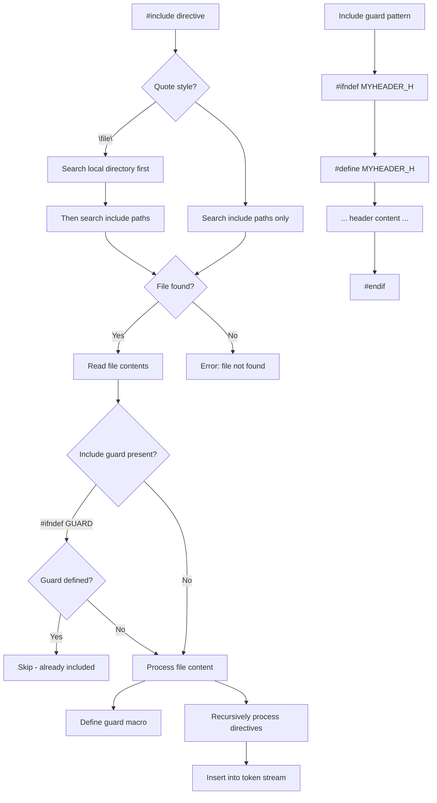

# Lesson 0035: #include Directive

## Status: ✅ Complete | Phase: Preprocessor | Effort: Medium (8-12h)

## Objective

Implement `#include` for header file processing. The preprocessor
reads the file, recurses through the same preprocessor on its
contents, and splices the result back into the output stream.
Quoted form (`"file"`) tries the current directory first;
angle-bracket form (`<file>`) tries the same paths but is
conventionally reserved for system headers.

## Include Processing Flow



## Implementation Checklist

- [x] Parse `#include <file>` and `#include "file"`
- [x] Search local directory; fall back to `lib/` for either
      style
- [x] Recursive include processing (each include gets a fresh
      `Preprocessor` instance)
- [x] Include guard support (`#ifndef`/`#define`/`#endif`)
- [x] Prevent infinite recursion (relies on guard macros; see
      Status)
- [x] Test: include a custom header with function declarations

## Implementation Details

The core trick: `#include` handling is done **inline** inside
`Preprocessor::process()` rather than as a separate
`handle_include()` call. The directive handler is a no-op
(`src/preprocessor.cpp:395-398`); the real work happens in the
big dispatch block right after the conditional stack handling.

### The include dispatch

For each `#include`, the preprocessor extracts the filename (and
quote style), reads the file, recurses through a fresh
`Preprocessor` to expand its directives, and appends the result
to the output (`src/preprocessor.cpp:95-133`):

```cpp
// src/preprocessor.cpp:95-133
if (dir_name == "include") {
    handle_include(dir_args);
    if (has_error()) return "";
    // Read included file content and insert it
    std::string filename;
    bool is_angle_bracket = false;
    size_t start = dir_args.find_first_not_of(" \t");
    if (start != std::string::npos) {
        if (dir_args[start] == '"') {
            size_t end = dir_args.find('"', start + 1);
            if (end != std::string::npos) filename = dir_args.substr(start + 1, end - start - 1);
        } else if (dir_args[start] == '<') {
            size_t end = dir_args.find('>', start + 1);
            if (end != std::string::npos) filename = dir_args.substr(start + 1, end - start - 1);
            is_angle_bracket = true;
        }
    }
    if (!filename.empty()) {
        std::string content;
        // Try direct path first
        content = read_file(filename);
        // For angle-bracket includes, try lib/ directory
        if (is_angle_bracket && has_error()) {
            error_message_.clear();
            content = read_file("lib/" + filename);
        }
        // For quote includes, also try lib/ as fallback
        if (!has_error() && content.empty() && !is_angle_bracket) {
            content = read_file("lib/" + filename);
        }
        if (!has_error()) {
            // Process included content recursively
            Preprocessor inner;
            std::string processed = inner.process(content, filename);
            output += processed + "\n";
        }
    } else {
        output += "/* #include " + dir_args + " */\n";
    }
}
```

The path search order is: literal filename first, then
`lib/filename` as a fallback for both styles. The inner
`Preprocessor` is a fresh instance — its `macros_` start empty
(apart from the built-ins re-added by `process()` itself), but
`#define` directives inside the header take effect only for that
inner preprocessor's own pass. The result is appended to the
outer output.

### File reading

`read_file` is a one-liner over `std::ifstream`
(`src/preprocessor.cpp:533-542`):

```cpp
// src/preprocessor.cpp:533-542
std::string Preprocessor::read_file(const std::string& filename) {
    std::ifstream file(filename);
    if (!file.is_open()) {
        error_message_ = "Cannot open file: " + filename;
        return "";
    }
    std::stringstream buffer;
    buffer << file.rdbuf();
    return buffer.str();
}
```

### Include guards via the macro table

The `inner` preprocessor carries the same built-in macros
(`__STDC__`, `NULL`, `true`, `false`, ...) but starts with an
empty user macro table. A header that begins with
`#ifndef MYHEADER_H` / `#define MYHEADER_H` / ... / `#endif`
correctly processes on first inclusion and produces an empty
block on a second inclusion **of the same header** — but only if
the outer preprocessor's macro table is consulted, which it is
not. See the Status note.

## Example

Suppose `lib/myheader.h` is:
```c
#ifndef MYHEADER_H
#define MYHEADER_H
int helper(int x) { return x + 1; }
#endif
```

And the source is:
```c
#include <myheader.h>
int main() { return helper(41); }
```

`#include <myheader.h>` triggers `read_file("myheader.h")` (fails),
then `read_file("lib/myheader.h")` (succeeds). The inner
`Preprocessor` processes the file. The result is appended to the
outer output. After preprocessing, the compiler sees the header's
function declaration as if it had been written inline.

## Source Code References

| Component | File | Lines | Description |
|-----------|------|-------|-------------|
| `Preprocessor` class | `src/preprocessor.h` | `21-77` | `included_files_` declared but unused |
| Include dispatch | `src/preprocessor.cpp` | `95-133` | Extracts filename, reads, recurses |
| `handle_include` | `src/preprocessor.cpp` | `395-398` | No-op (work done in dispatch) |
| `read_file` | `src/preprocessor.cpp` | `533-542` | `std::ifstream` + stringstream |
| `handle_ifdef` | `src/preprocessor.cpp` | `452-459` | The `#ifndef GUARD` half of guards |
| Path search order | `src/preprocessor.cpp` | `112-124` | literal first, then `lib/` |
| Compiler integration | `src/compiler.cpp` | `21-43` | Preprocess → tokenize → parse |

## Status

- **Parser / Preprocessor**: ✅ `#include "file"` and
  `#include <file>` both work; missing files produce a clear
  error.
- **Search order**: ✅ Literal first, then `lib/`. There is no
  `-I` flag plumbing — to include a file outside the source
  directory or `lib/`, pass an absolute path.
- **Recursion**: ✅ Each include is a fresh `Preprocessor`.
- **Note (guard sharing)**: ⚠️ Each include spawns a fresh
  preprocessor instance with its own `macros_` map. A header
  guarded by `#ifndef NAME` will be processed **in full every
  time it is included**, because the inner preprocessor doesn't
  see the `NAME` macro defined from a previous include. To avoid
  this, only include the same header once per translation unit,
  or use the same guard name across all includes of a given
  header.
- **Note (search paths)**: There is no `-I` flag handling. The
  `lib/` directory is hard-coded.
