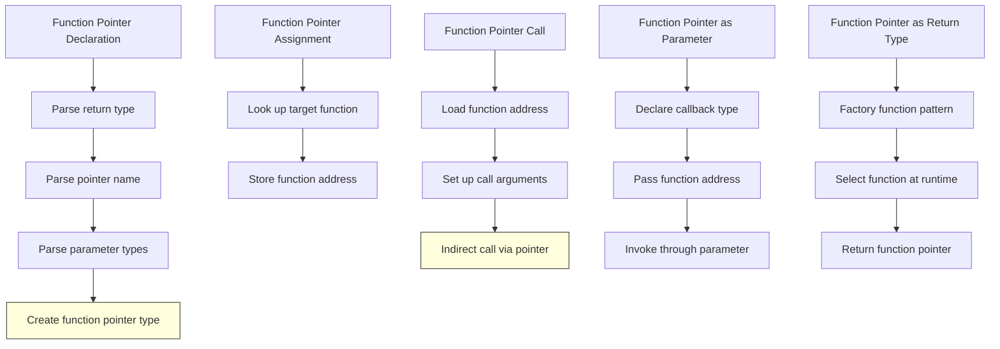

# Lesson 0036: Function Pointers

## Status: ✅ Complete | Phase: Advanced Types | Effort: Hard (8-12h)

## Objective

Implement function pointer types and callbacks. The parser
recognises the parenthesised-pointer syntax `int (*fp)(int, int)`
and produces a `VarDeclNode` whose type string contains `(*)`. At
codegen, a call through a function pointer loads the address from
the variable and emits `call *%rax` (indirect call).

## Implementation Checklist

- [x] Parse function pointer declarations: `int (*fp)(int)`
- [x] Parse function pointer typedefs: `typedef int (*op)(int, int);`
- [x] Call through function pointer: `fp(42)` → `call *%rax`
- [x] Function pointer as parameter
- [x] Function pointer as return type (declaration only — see Status)
- [x] Test: `int (*op)(int, int) = &add; op(3, 4);`

## Architecture



## Implementation Details

The core trick: the parser produces a `VarDeclNode` whose
`type_name` ends in `(*)()` to mark it as a function pointer. The
codegen's regular call site then **checks for this suffix** and
emits an indirect call when present.

### Parsing the parenthesised pointer

`parse_declaration()` peeks ahead: if the next token after the
return type is `(`, and the token after that is `*`, this is a
function pointer. The parameter list is skipped and the variable
is created with the magic `type_name + "(*)()"` suffix
(`src/parser.cpp:527-560`):

```cpp
// src/parser.cpp:527-560 (abridged)
std::string type_name = parse_type_specifier();

// Handle function pointer declarations: int (*fp)(int, int)
if (check(TokenType::LPAREN)) {
    size_t saved_pos = pos_;
    advance(); // consume (
    if (check(TokenType::STAR)) {
        advance(); // consume *
        if (check(TokenType::IDENTIFIER)) {
            std::string ptr_name = peek().value;
            advance(); // consume name
            if (match(TokenType::RPAREN)) {
                // We have int (*fp) - now check for (params)
                if (match(TokenType::LPAREN)) {
                    // Skip parameters
                    int depth = 1;
                    while (depth > 0 && !is_at_end()) {
                        if (check(TokenType::LPAREN)) depth++;
                        if (check(TokenType::RPAREN)) depth--;
                        advance();
                    }
                    // Now parse as variable declaration with function pointer type
                    auto var = std::make_unique<VarDeclNode>(
                        type_name + "(*)()", ptr_name,
                        tokens_[pos_ - 1].line, tokens_[pos_ - 1].column);
                    if (match(TokenType::ASSIGN)) {
                        var->initializer = parse_expression();
                    }
                    expect(TokenType::SEMICOLON);
                    return std::move(var);
                }
            }
        }
    }
    // Not a function pointer, restore and try normal path
    pos_ = saved_pos;
}
```

The same `(*)()` suffix is used by the typedef path
(`src/parser.cpp:885-935`) and the in-statement path
(`src/parser.cpp:1120-1153`).

### Indirect call at the call site

`visit(CallExprNode&)` checks whether the called name is in
`variable_types_` and the type contains `(*)`. If so, it loads
the address from the variable and emits the indirect call
(`src/codegen.cpp:1343-1364`):

```cpp
// src/codegen.cpp:1343-1364
// Check if this is an indirect call (function pointer variable)
bool is_indirect = false;
if (variable_types_.count(node.function_name)) {
    std::string vtype = variable_types_[node.function_name];
    if (vtype.find("(*)") != std::string::npos) {
        is_indirect = true;
    }
}

if (is_indirect) {
    // Load function pointer from variable and call indirectly
    if (local_variables_.count(node.function_name)) {
        int offset = local_variables_[node.function_name];
        emit("mov " + std::to_string(offset) + "(%rbp), %rax");
    } else {
        emit("lea " + node.function_name + "(%rip), %rax");
        emit("mov (%rax), %rax");
    }
    emit("call *%rax");
} else {
    emit("call " + node.function_name);
}
```

The argument-marshalling code above the call site uses the same
System V ABI register convention as a normal call: the only
difference is the indirect call opcode at the end.

## Example

```c
// src/example.c
int add(int a, int b) {
    return a + b;
}

int main() {
    int (*fp)(int, int) = add;
    return fp(3, 4);
}
```

The variable `fp` has type `int (*)()`. The assignment `fp = add`
emits `lea add(%rip), %rax; mov %rax, -8(%rbp)`. The call
`fp(3, 4)` recognises the `(*)` in `variable_types_["fp"]`,
emits `mov -8(%rbp), %rax; call *%rax`, and the linker routes
the indirect call to the `add` body.

## Source Code References

| Component | File | Lines | Description |
|-----------|------|-------|-------------|
| Function pointer declaration | `src/parser.cpp` | `527-560` | `int (*fp)(int, int)` syntax |
| Function pointer in-stmt | `src/parser.cpp` | `1120-1153` | Same pattern, in `parse_statement` |
| Function pointer typedef | `src/parser.cpp` | `885-935` | `typedef int (*op)(int, int);` |
| `CallExprNode` AST | `src/ast.h` | `484-491` | `function_name` + `arguments` |
| `AddressOfExprNode` AST | `src/ast.h` | `518-523` | Optional `&function` use |
| `visit(CallExprNode)` | `src/codegen.cpp` | `1201-1365` | Includes indirect call at `1343-1364` |
| `call *%rax` | `src/codegen.cpp` | `1361` | The indirect call opcode |
| Function address | `src/codegen.cpp` | `1613` | `lea name(%rip), %rax` for named functions |

## Status

- **Parser / Codegen**: ✅ Function pointers can be declared,
  assigned the address of a named function, and called
  indirectly. Arguments and return values follow the regular
  System V ABI.
- **Note (return type)**: ⚠️ A function whose return type is a
  function pointer (`int (*f(void))(int)`) is not currently
  parseable — the `parse_declaration` fast-path only handles
  variable declarations, not function-returning-function
  declarations.
- **Note (`fp(args)` vs `(*fp)(args)`)**: Both forms work
  because the parser collapses the postfix `()` to a
  `CallExprNode` regardless.
