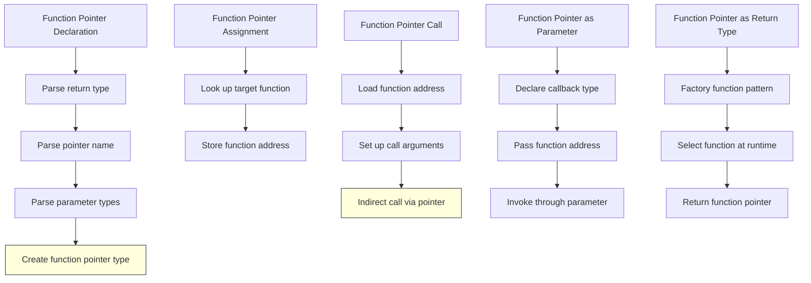

# Lesson 0036: Function Pointers

## Status: 📋 Planned | Phase: Advanced Types | Effort: Hard (8-12h)

## Objective

Implement function pointer types and callbacks.

## Implementation Checklist

- [ ] Parse function pointer declarations: `void (*handler)(int)`
- [ ] Parse function pointer typedefs
- [ ] Call through function pointer: `handler(42)`
- [ ] Function pointer as parameter
- [ ] Function pointer as return type
- [ ] Test: `void (*op)(int) = &print_int; op(42);`

## Architecture

