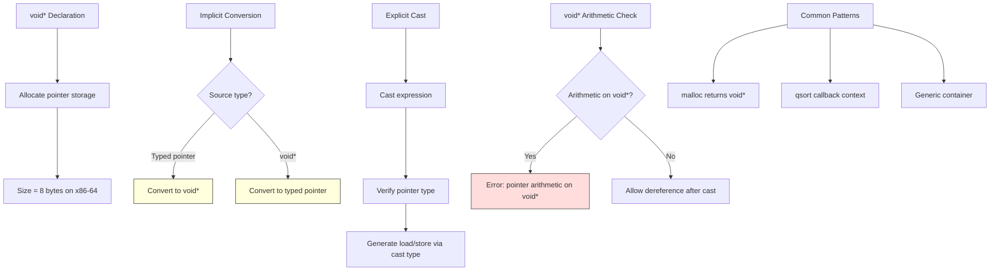

# Lesson 0037: void Pointers

## Status: ✅ Complete | Phase: Advanced Types | Effort: Easy (2-3h)

## Objective

Implement `void*` as generic pointer type.

## Implementation Checklist

- [ ] Treat `void*` as pointer type (size = 8)
- [ ] Allow implicit conversion to/from `void*`
- [ ] Allow casting between pointer types
- [ ] Test: `void *p = &x; int *q = (int*)p; return *q;`

## Architecture

## Implementation Details

| Component | File | Lines | Description |
|-----------|------|-------|-------------|
| Type specifier parsing (void) | `src/parser.cpp` | 87-183 | `parse_type_specifier()` handles `void` keyword and pointer stars |
| Pointer type detection | `src/parser.cpp` | 177-180 | Appends `*` to type string for pointer qualifiers |
| Deref expression AST | `src/ast.h` | 480-485 | `DerefExprNode` for `*p` dereference operations |
| Type size calculation | `src/codegen.cpp` | 1197-1214 | Returns 8 bytes for `void*` and any pointer type |
| Deref codegen | `src/codegen.cpp` | 907-910 | `mov (%rax), %rax` to dereference pointer |
| Cast expression support | `src/codegen.cpp` | 832-836 | `(int*)vp` cast expressions pass through to operand |
| Identifier address loading | `src/codegen.cpp` | 942-966 | `lea offset(%rbp), %rax` for pointer variables |
