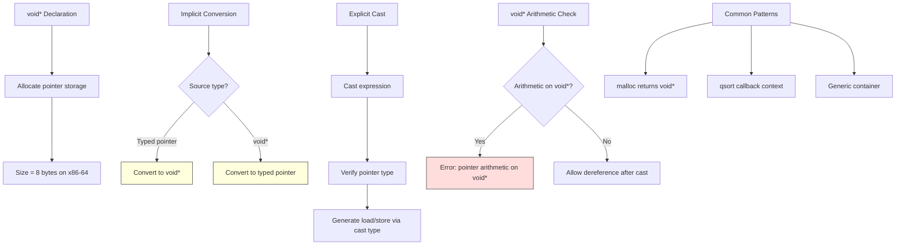

# Lesson 0037: void Pointers

## Status: 📋 Planned | Phase: Advanced Types | Effort: Easy (2-3h)

## Objective

Implement `void*` as generic pointer type.

## Implementation Checklist

- [ ] Treat `void*` as pointer type (size = 8)
- [ ] Allow implicit conversion to/from `void*`
- [ ] Allow casting between pointer types
- [ ] Test: `void *p = &x; int *q = (int*)p; return *q;`

## Architecture

