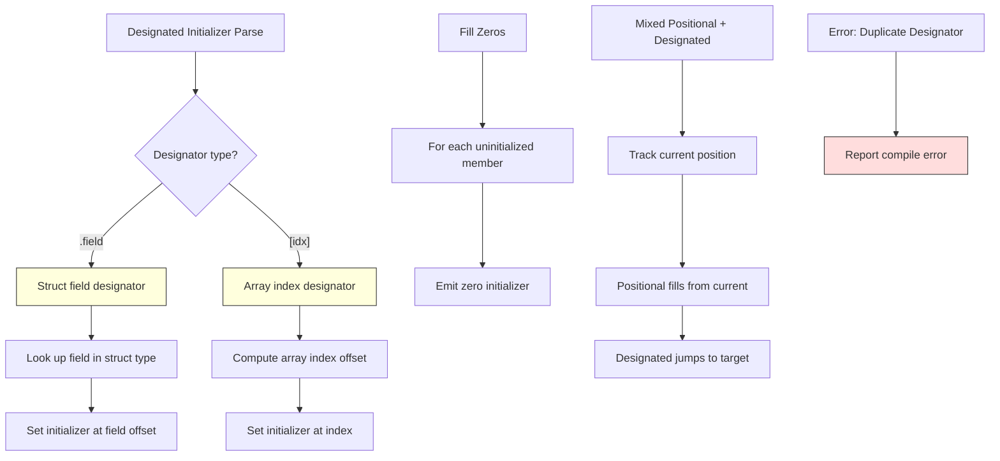

# Lesson 0038: Designated Initializers (C99)

## Status: 📋 Planned | Phase: Advanced Types | Effort: Medium (6-8h)

## Objective

Implement `.field = value` and `[index] = value` in initializer lists.

## Implementation Checklist

- [ ] Parse `.field = value` in struct initializers
- [ ] Parse `[index] = value` in array initializers
- [ ] Fill unspecified members with zeros
- [ ] Handle nested designators
- [ ] Error on duplicate designators
- [ ] Test: `struct { int a; int b; } s = { .b = 42 };`

## Architecture

