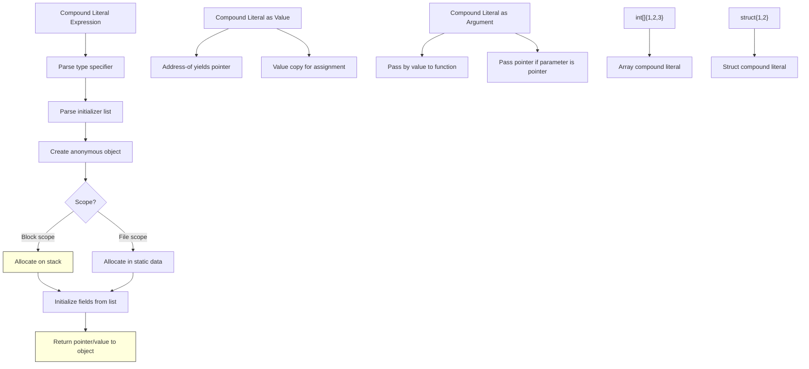

# Lesson 0039: Compound Literals (C99)

## Status: 📋 Planned | Phase: Advanced Types | Effort: Medium (4-6h)

## Objective

Implement `(type){init-list}` for unnamed objects.

## Implementation Checklist

- [ ] Parse `(type){init-list}` expression syntax
- [ ] Create anonymous object in current scope
- [ ] Generate stack allocation for block-scope literals
- [ ] Support struct, array, and scalar compound literals
- [ ] Test: `return (struct Point){1, 2}.x;` → 1

## Architecture

## Implementation Details

| Component | File | Lines | Description |
|-----------|------|-------|-------------|
| Cast expression parsing | `src/parser.cpp` | 1111-1126 | `parse_unary()` detects `(type)expr` cast syntax via lookahead |
| Type specifier in cast | `src/parser.cpp` | 1115-1121 | Validates type after `(` and creates `CastExprNode` |
| CastExprNode structure | `src/ast.h` | 444-451 | Stores `target_type` string and inner `expr` |
| Cast codegen | `src/codegen.cpp` | 832-836 | Evaluates inner expression (type coercion not yet implemented) |
| Address-of compound literal | `src/codegen.cpp` | 1108-1129 | `&(type){...}` uses ADDRESS_OF operator |
| VarDeclNode initializer | `src/ast.h` | 213-222 | Initializer AST pointer for compound literal assignments |
