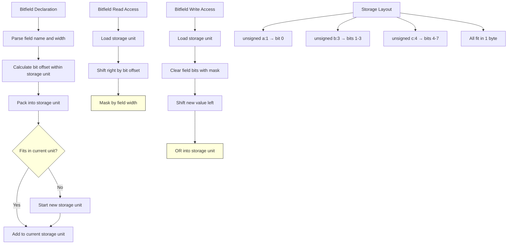

# Lesson 0040: Bitfields

## Status: 📋 Planned | Phase: Advanced Types | Effort: Medium (4-6h)

## Objective

Implement bitfield members in structs.

## Implementation Checklist

- [ ] Parse `unsigned int field : width;`
- [ ] Calculate bitfield storage units
- [ ] Generate bit manipulation code for access
- [ ] Handle bitfield packing across storage units
- [ ] Test: `struct { unsigned a:1; unsigned b:3; } s; s.b = 5;`

## Architecture

