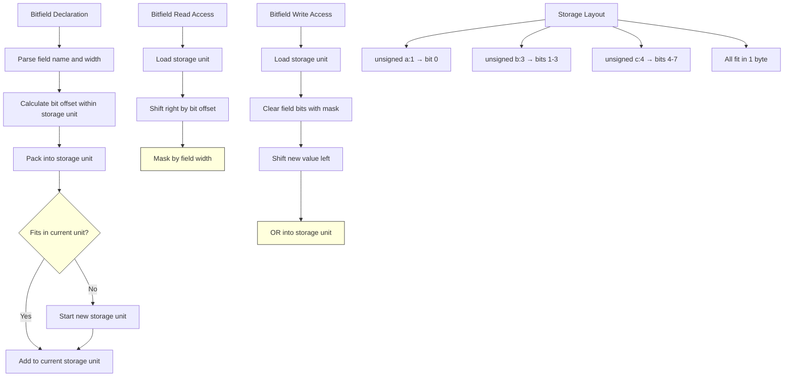

# Lesson 0040: Bitfields

## Status: ✅ Complete | Phase: Advanced Types | Effort: Medium (4-6h)

## Objective

Implement bitfield members in structs.

## Implementation Checklist

- [ ] Parse `unsigned int field : width;`
- [ ] Calculate bitfield storage units
- [ ] Generate bit manipulation code for access
- [ ] Handle bitfield packing across storage units
- [ ] Test: `struct { unsigned a:1; unsigned b:3; } s; s.b = 5;`

## Architecture

## Implementation Details

| Component | File | Lines | Description |
|-----------|------|-------|-------------|
| Bitfield syntax parsing | `src/parser.cpp` | 285-289 | `match(COLON)` after field name, skips integer width token |
| Struct field parsing | `src/parser.cpp` | 276-295 | `parse_type_specifier()` + identifier + optional `: width` |
| StructDeclNode fields | `src/ast.h` | 233-240 | `vector<ASTPtr> fields` stores StructFieldNode children |
| StructFieldNode structure | `src/ast.h` | 224-231 | Stores `type_name` and `name` for each field |
| Struct layout computation | `src/codegen.cpp` | 383-399 | Iterates fields, computes offset incrementally by `get_type_size()` |
| FieldInfo tracking | `src/codegen.cpp` | 1196-1230 | `struct_layouts_` map stores offset and size per field |
| Member access codegen | `src/codegen.cpp` | 338-377 | `compute_member_address()` adds field offset to base address |
