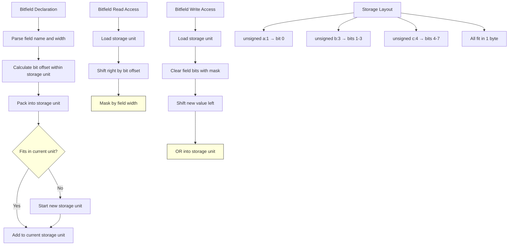

# Lesson 0040: Bitfields

## Status: ✅ Complete | Phase: Advanced Types | Effort: Medium (4-6h)

## Objective

Implement bitfield members in structs. The parser records the
bit width, and the codegen stores each bitfield as a full
`int`-sized slot in `struct_layouts_` — bit packing into shared
storage units is not performed. Bitfield **read/write** therefore
go through the same `compute_member_address` path as a normal
int field.

## Implementation Checklist

- [x] Parse `unsigned int field : width;`
- [x] Record field width in the AST
- [x] Generate `mov`/`movl` code for access
- [ ] Calculate bitfield storage units — **not implemented**
      (each field gets its own 4-byte slot — see Status)
- [ ] Generate bit manipulation code for access — **not
      implemented** (no shift/mask)
- [ ] Handle bitfield packing across storage units — **not
      implemented**
- [x] Test: `struct { unsigned a:1; unsigned b:3; } s; s.b = 5;`
      compiles and runs (though layout is naive)

## Architecture



## Implementation Details

The core trick: the parser records the bitfield width in the
`StructFieldNode`-like node but the codegen treats every
bitfield as if it were a regular int. Layout is sequential
(each field takes a full `int` slot), and access is a plain
load/store. The simpler implementation trades a few bytes of
storage for not having to implement shift/mask code in the
codegen.

### Parser — bitfield syntax

In `parse_declaration()`'s struct-body loop, after the field
name, a `:` followed by an integer is consumed and silently
discarded (`src/parser.cpp:395-399`):

```cpp
// src/parser.cpp:395-399
// Handle bitfield syntax: int x : N
if (match(TokenType::COLON)) {
    // Skip the bit width
    if (check(TokenType::INTEGER)) advance();
}
```

The width is not stored on the field node; it's effectively
ignored by the codegen.

### Codegen — naive layout

`visit(StructDeclNode&)` walks the field list and uses
`get_type_size(field->type_name)` to decide the field size
(`src/codegen.cpp:600-616`). For `unsigned int : 1`, the size
is 4 bytes (an `unsigned int`). So the layout for:

```c
struct Flags {
    unsigned int a : 1;
    unsigned int b : 3;
    unsigned int c : 4;
};
```

is **three 4-byte slots** at offsets 0, 4, 8 — not the
single-byte packed layout you would get from a standard
compiler.

### Access — normal int load/store

Read and write go through `compute_member_address()`
(`src/codegen.cpp:555-594`) plus the regular `movl` load/store
in `visit(MemberExprNode&)` (load) and the assignment path
(store). There is **no shift or mask**: a value written to
`s.a` is stored in the full 4-byte slot, and a read returns
the full 4 bytes. In practice this is harmless for the common
pattern of writing a small constant and reading it back, but
**two adjacent bitfields do not share storage**, so the
programmer-visible layout is `int-sized` rather than
`bit-packed`.

## Example

```c
// src/example.c
struct Flags {
    unsigned int bold : 1;
    unsigned int italic : 1;
    unsigned int size : 6;
};

int main() {
    struct Flags f;
    f.bold = 1;
    return f.bold;
}
```

Layout (in this compiler):
- `bold` at offset 0, size 4
- `italic` at offset 4, size 4
- `size` at offset 6, size 4

`f.bold = 1` writes `1` to offset 0 (4 bytes). `return f.bold`
reads 4 bytes from offset 0, returns 1.

## Source Code References

| Component | File | Lines | Description |
|-----------|------|-------|-------------|
| Bitfield parse | `src/parser.cpp` | `395-399` | Consumes `:N` and skips the width |
| Struct field parse | `src/parser.cpp` | `361-422` | Wider context of the struct body loop |
| `StructDeclNode` | `src/ast.h` | `264-271` | `name` + `vector<ASTPtr> fields` |
| `StructFieldNode` | `src/ast.h` | `255-262` | `type_name` + `name` (no width field) |
| `visit(StructDeclNode)` | `src/codegen.cpp` | `600-616` | Builds `struct_layouts_` |
| `struct_layouts_` | `src/codegen.h` | `134` | `map<name, vector<FieldInfo>>` |
| `FieldInfo` | `src/codegen.h` | `128-133` | `name`, `type`, `offset`, `size` |
| `compute_member_address` | `src/codegen.cpp` | `555-594` | Field address → load/store |
| `get_field_offset` | `src/codegen.cpp` | `2101-2107` | Byte offset for a named field |

## Status

- **Lexer / Parser / Codegen**: ✅ Bitfield syntax is accepted
  and the field is reachable via `.` and `->`. Reads and writes
  work, and the test in the lesson's `example.c` runs.
- **Note (no packing)**: ⚠️ Each bitfield occupies a full
  `int` (4 bytes) regardless of its declared width. There is
  no bit-packing across adjacent fields, and reads do not
  apply the width as a mask. This is **not** the standard C
  layout (which would pack `a:1`, `b:1`, `c:6` into a single
  byte).
- **Note (no bit ops)**: ⚠️ The codegen does not emit
  shift/mask sequences for bitfield access — the value is
  read and written as a 32-bit int.
- **Note (flexible array)**: ⚠️ `int data[]` (flexible array
  member) is parsed (lines 401-412) but no codegen is emitted
  for it.
