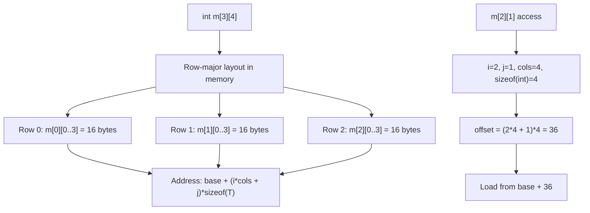

# Lesson 0041: Multi-Dimensional Arrays

## Status: 📋 Planned | Phase: Advanced Types | Effort: Medium (6-8h)

## Objective

Implement `int arr[3][4]` and multi-dimensional indexing.

## Multi-Dimensional Array Layout

## Implementation Checklist

- [ ] Parse multi-dimensional array declarations
- [ ] Row-major offset calculation: `arr[i][j] = base + i * cols * sizeof + j * sizeof`
- [ ] Array-to-pointer decay for each dimension
- [ ] Test: `int m[2][3] = {{1,2,3},{4,5,6}}; return m[1][1];` → 5
