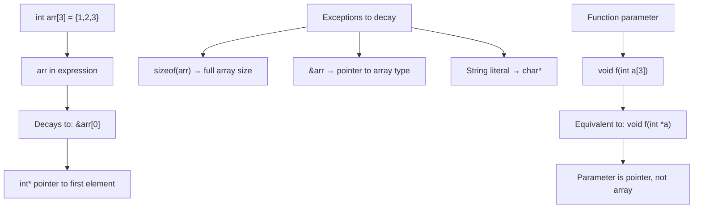

# Lesson 0042: Array-to-Pointer Decay

## Status: 📋 Planned | Phase: Advanced Types | Effort: Easy (2-3h)

## Objective

Implement automatic conversion from array to pointer.

## Array-to-Pointer Decay

## Implementation Checklist

- [ ] Array name in expression → pointer to first element
- [ ] Exception: `sizeof(array)` returns full array size
- [ ] Exception: `&array` returns pointer to array
- [ ] Function parameters: arrays become pointers
- [ ] Test: `int a[3] = {1,2,3}; int *p = a; return *p;` → 1

## Implementation Details

| Component | File | Lines | Description |
|-----------|------|-------|-------------|
| Parameter array decay | `src/parser.cpp` | 624-629 | `param->type_name += "*"` converts `int arr[]` to `int*` |
| Parameter array parsing | `src/parser.cpp` | 604-612 | Handles `int arr[10]` parameter syntax with optional size |
| Identifier for arrays | `src/codegen.cpp` | 942-966 | Returns base address via `lea` for array names (decay behavior) |
| Array info tracking | `src/codegen.cpp` | 327-329 | `array_info_` map distinguishes arrays from scalar variables |
| Index codegen | `src/codegen.cpp` | 856-897 | Array subscript `arr[i]` computes `base + i * elem_size` |
| sizeof for arrays | `src/codegen.cpp` | 810-830 | `SizeofExprNode` returns type size; arrays use `elem_size * count` |
| Variable type storage | `src/codegen.cpp` | 323-324 | `variable_types_[name]` tracks base type for sizeof calculations |
