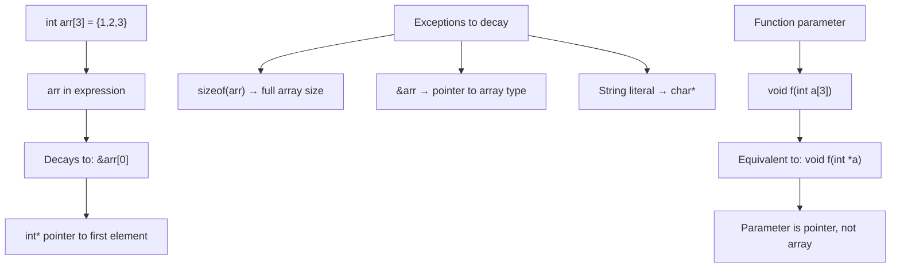

# Lesson 0042: Array-to-Pointer Decay

## Status: 📋 Planned | Phase: Advanced Types | Effort: Easy (2-3h)

## Objective

Implement automatic conversion from array to pointer.

## Array-to-Pointer Decay

## Implementation Checklist

- [ ] Array name in expression → pointer to first element
- [ ] Exception: `sizeof(array)` returns full array size
- [ ] Exception: `&array` returns pointer to array
- [ ] Function parameters: arrays become pointers
- [ ] Test: `int a[3] = {1,2,3}; int *p = a; return *p;` → 1
